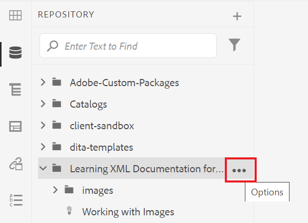
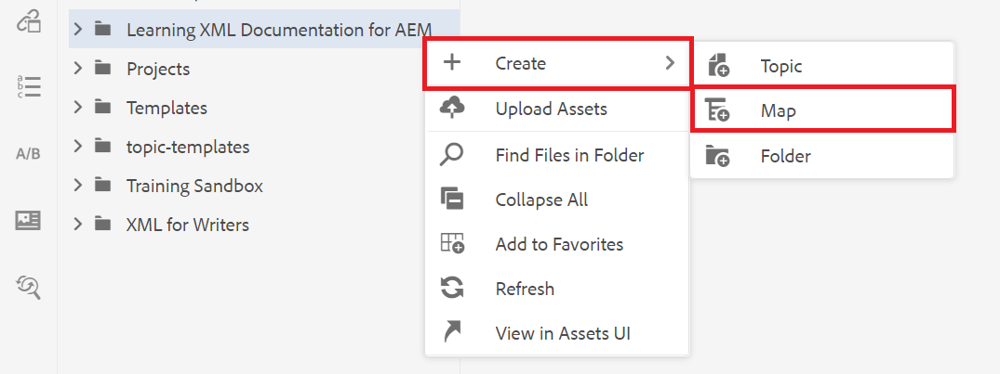
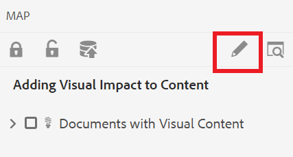
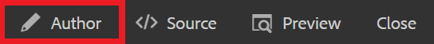

# マップを作成する

マップは、情報を階層構造で追加および整理できる組織的なツールです。 このタスクでは、マップを作成し、マップ内のコンテンツを整理する方法を示します。

DITA ファイルの例は、次の場所からダウンロードできます。

* [Documents-with-Visual-Content.dita](assets/working-with-maps/Documents-with-Visual-Content.dita)
* [Working-with-Tables.dita](assets/working-with-maps/Working-with-Tables.dita)

>[!VIDEO](https://video.tv.adobe.com/v/336725?quality=12&learn=on)

## マップコンポーネントをアップロード

必要に応じて、ローカルのサンプルファイルをAEMにアップロードして、より包括的な資料を取得できます。

1. ローカルファイルをAEMにドラッグ&amp;ドロップしてアップロードします。
1. 画像やトピックを含むすべてのファイルに対して、必要に応じて繰り返します。

## マップを作成する

1. 次の手順で [!UICONTROL オプション] メニューから、メインフォルダーの省略記号アイコンを選択します。

   

1. 選択 **[!UICONTROL 作成]** > **[!UICONTROL マップ]**.

   

   この [!UICONTROL 新規マップを作成] ダイアログが表示されます。

1. 内 [!UICONTROL テンプレート] フィールド、選択 **[!UICONTROL ブックマップ]** をクリックし、マップにタイトルを付けます。
1. 「**[!UICONTROL 作成]**」を選択します。

   マップが作成され、左側のレールがリポジトリビューからマップビューに自動的に変更されます。

## マップコンポーネントを挿入

1. 左側のレールで鉛筆アイコンを選択します。

   

   これは編集アイコンで、マップをエディターで開くことができます。

1. リポジトリアイコンを選択して、リポジトリ表示に戻ります。

   

1. リポジトリからエディターのマップにトピックをドラッグ&amp;ドロップして、マップに追加します。

   行インジケーターは、トピックが配置されている場所を示します。

1. 必要に応じて、トピックの追加を続けます。

## マッププレビューを表示する

プレビューでは、デフォルト形式を使用してコンテンツをすばやく確認できます。 見出し、段落、リスト、およびトピック内のその他のコンテンツが表示されます。

1. 選択 **[!UICONTROL プレビュー]** 上部の黒いメニューバーから

   

コンテンツがで開きます。 [!UICONTROL プレビュー].

1. オーサー表示に戻り、マップ編集を再開するには、「 」を選択します。 **作成者。**

   

## マップ構造を設定

マップ内のトピックの階層を編集できます。

1. トピックのアイコンをクリックして選択します。
1. 矢印を使用して、要素をそれぞれ降順に、昇格させます。

   

## マップを新しいバージョンとして保存

マップが完了したら、作業内容を新しいバージョンとして保存し、変更を記録できます。

1. を選択します。 **[!UICONTROL 新しいバージョンとして保存]** アイコン

   

1. 「新しいバージョンに対するコメント」フィールドに、変更の概要を簡潔かつ明確に入力します。

1. 「バージョンラベル」フィールドに、関連するラベルを入力します。

   ラベルを使用すると、公開時に含めるバージョンを指定できます。

   >[!NOTE]
   > 
   > プログラムに事前定義済みのラベルが設定されている場合は、ラベル付けの一貫性を保つために、これらのラベルから選択できます。

1. 「**保存**」を選択します。

   マップの新しいバージョンが作成され、バージョン番号が更新されます。
