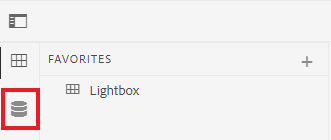
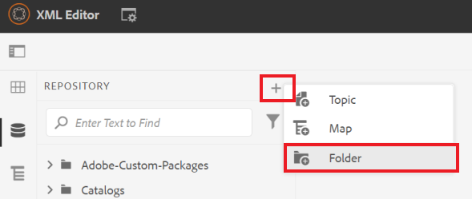
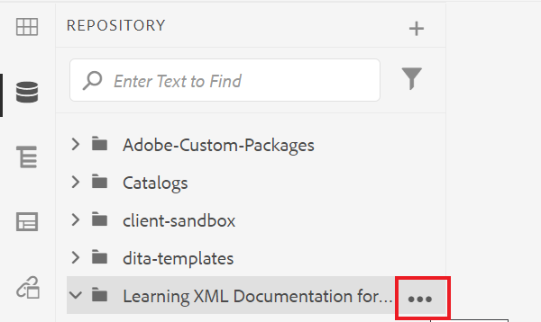
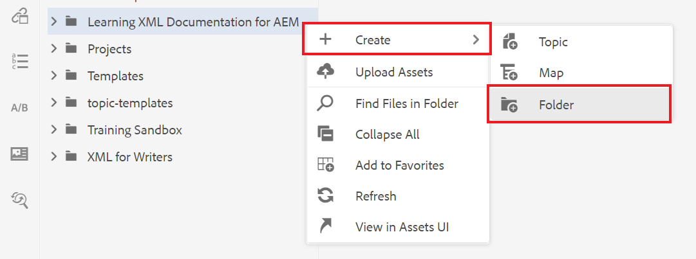
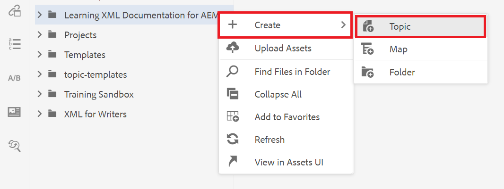
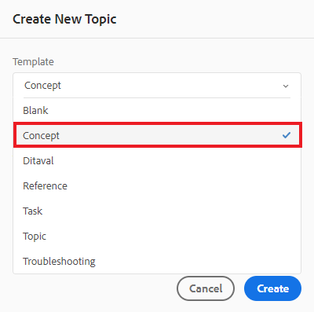
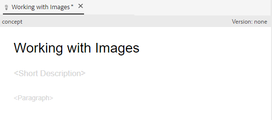

# コンテンツの作成と構造化

ユーザーインターフェイスに慣れたら、独自のコンテンツの作成と構造化を開始できます。

>[!VIDEO](https://video.tv.adobe.com/v/336657?quality=12&learn=on)

## フォルダーの作成

1. を選択します。 **リポジトリ** アイコンをクリックして、フォルダーとファイルを表示します。

   

1. を選択します。 **+** アイコンと **フォルダー**.

   
1. フォルダーにタイトルを付けます。
1. 「**作成**」を選択します。新しいフォルダーを作成し、リポジトリに表示します。 このフォルダは、すべてのコースコンテンツのホームになります。

## サブフォルダーの作成

これで、新しいフォルダー内にフォルダーを作成して、画像や他のコンテンツを格納できます。

1. リポジトリ内の新しいフォルダーの上にマウスポインターを置き、表示される省略記号アイコンを選択します。

   

   オプションメニューが表示されます。
1. 選択 **\> フォルダーを作成**.
   

1. サブフォルダーにタイトル（「images」など）を付け、「 」を選択します。 **作成**.

## 新しい概念の作成と入力

1. リポジトリ内の親フォルダーの上にマウスポインターを置き、省略記号アイコンを選択します。

   

   オプションメニューが表示されます。
1. 選択 **\> トピックを作成**.

   

   [ 新規トピックを作成 ] ダイアログが表示されます。

1. ダイアログのテンプレートドロップダウンメニューから、「 」を選択します。 **概念**.

   

1. 概念にタイトルを付け、「 」を選択します。 **作成**.

   新しい概念がエディターに表示され、タイトルが設定されます。

   

1. 短い説明または段落をクリックし、コンテンツを入力して、概念を設定します。

## 保存して新しいバージョンとして保存

「保存」または「新しいバージョンとして保存」を使用すると、作業内容をいつでも保存できます。 「保存」を使用して変更を保持し、「新しいバージョンとして保存」を使用して、現在の変更を含む新しいバージョンのトピックを作成します。

### バージョン管理なしで作業を保存中

1. を選択します。 **保存** アイコン

   

### 新しいバージョンとして保存中

1. を選択します。 **新しいバージョンとして保存** アイコンをクリックします。

   

   [ 新しいバージョンとして保存 ] ダイアログボックスが表示されます。

1. 「新しいバージョンに対するコメント」フィールドに、変更の概要を簡潔かつ明確に入力します。
1. 「バージョンラベル」フィールドに、関連するラベルを入力します。

   ラベルを使用すると、公開時に含めるバージョンを指定できます。

   >[!NOTE]
   > 
   > プログラムに事前定義済みのラベルが設定されている場合は、ラベル付けの一貫性を保つために、これらのラベルから選択できます。
1. 「**保存**」を選択します。

   トピックの新しいバージョンが作成され、バージョン番号が更新されました。
