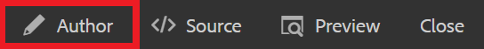

# Web サイトへのリンク

Web リンクは、読者を Web サイトに誘導して詳細を知らせ、外部コンテンツとのやり取りや、ダウンロード可能なファイルへのアクセスを許可します。 次の手順では、既存の概念に Web リンクを追加する方法について説明します。

>[!VIDEO](https://video.tv.adobe.com/v/336656?quality=12&learn=on)

## リンクの挿入

1. 概念をリポジトリから選択し、エディターで開きます。
1. 概念にテキストの文字列を追加してハイライト表示するか、既存のテキストをハイライト表示します。

   ハイライト表示されたこのテキストは、リンクが挿入される場所です。
1. を選択します。 **相互参照を挿入** 」ボタンをクリックします。

   

   [ 参照 ] ダイアログが表示されます。

1. 選択 **Web リンク** を選択します。
1. 目的の URL を貼り付けて、「 **選択**.

   リンクが機能し、クリックすると、新しいブラウザータブで Web ページが開きます。

## プレビューを使用したリンクのテスト

「プレビュー」ボタンを使用すると、トピックのプレビューを表示できます。 ここでは、リンクをテストし、オーディエンスと同じように表示できます。

1. 選択 **プレビュー** 上部の黒いメニューバーから

   

   概念がプレビューで開きます。

1. リンクを選択します。
リンク先が別のタブで開きます。
1. 「 」を選択してオーサービューに戻る **作成者** 上部の黒いメニューバーから

   

## 新しいバージョンとして保存中

これで、コンセプトにコンテンツを追加したので、作業内容を新しいバージョンとして保存し、変更を記録することができます。

1. を選択します。 **新しいバージョンとして保存** アイコン

   

1. 「新しいバージョンに対するコメント」フィールドに、変更の概要を簡潔かつ明確に入力します。
1. 「バージョンラベル」フィールドに、関連するラベルを入力します。

   ラベルを使用すると、公開時に含めるバージョンを指定できます。

   >[!NOTE]
   > 
   > プログラムに事前定義済みのラベルが設定されている場合は、ラベル付けの一貫性を保つために、これらのラベルから選択できます。

1. 「**保存**」を選択します。

   トピックの新しいバージョンが作成され、バージョン番号が更新されました。
