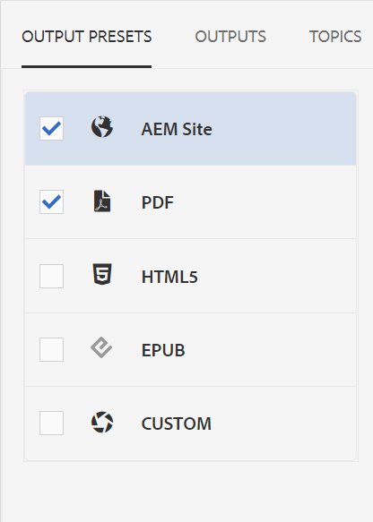
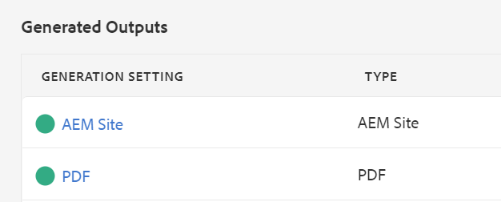

# デフォルト出力の公開

マップが完成したら、コンテンツを複数の出力形式でパブリッシュできます。

>[!VIDEO](https://video.tv.adobe.com/v/336662?quality=12&learn=on)

## マップをAEM Site およびPDFとしてパブリッシュする

選択できる出力プリセットは多数あります。 このガイドでは、AEM Site とPDF出力に焦点を当てます。

1. リポジトリで、マップの省略記号アイコンを選択してオプションメニューを開き、 **[ マップダッシュボード ] でを開きます。**

   

   別のタブにマップダッシュボードが開きます。

2. 「出力プリセット」タブで、「AEMサイト」と「PDF」を選択します。

   

3. 選択 **生成。**

4. 出力ページに移動して、生成された出力のステータスを表示します。

   緑の円は、生成が完了したことを示します。

   

## AEM Site の出力

AEMサイトの出力では、XML Editor で作成したトピック、リスト、画像、タイトル、テーブル、およびその他のコンテンツは、すべてAEMによって Web に適したコンテンツに自動的に公開されます。

目次や「関連情報」セクションに、下位のトピックが表示されます。 これらのリンクはすべて、ナビゲーションに使用できます。

## PDF出力

完成したPDFドキュメントには、表紙のメインタイトルとしてマップのデフォルトのタイトルが含まれます。 チャプターカバーページは、チャプター番号でスタイル設定され、内のトピックへのリンクが含まれます。
