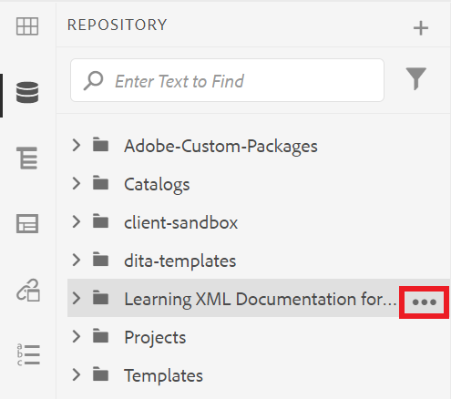
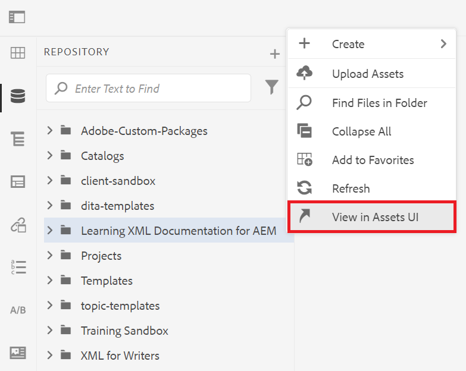
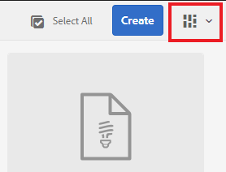
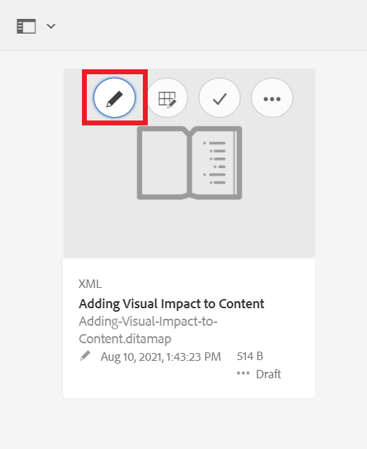

# AEMユーザーインターフェイスについて

XML Editor での管理に関するアセット、ファイル、フォルダーのExperience Manager。

>[!VIDEO](https://video.tv.adobe.com/v/336659?quality=12&learn=on)

## XML Editor へのアクセス

1. ログイン画面で、ユーザー名とパスワードを入力し、「 」を選択します。 **[!UICONTROL ログイン]**.
1. 選択 **[!UICONTROL XML Editor]** をAEMナビゲーションページから開きます。

## XML エディタビュー

サイドバーから、組織のニーズに最適な XML エディターの複数のビューから選択できます。 これには、デフォルトのビューや [!UICONTROL リポジトリ表示].

デフォルトのビューには、 [!UICONTROL お気に入り]. 必要に応じてショートカットを使用してさらにカスタマイズできます。 逆に、 [!UICONTROL リポジトリ表示] は、より従来のフォルダー構造を表示します。

### への切り替え [!UICONTROL リポジトリ表示] デフォルト表示から

1. 左側のレールで、「 」を選択します。 **[!UICONTROL リポジトリ表示]**.

   

   この [!UICONTROL リポジトリ表示] が表示されます。

## Assets UI

内 [!UICONTROL Assets] インターフェイスを使用して、

### Assets UI でのコンテンツの表示

コンテンツに対して追加のアクションを実行できます。 これらのオプションの 1 つは、ファイルを Assets UI に表示することです。

1. リポジトリ内のフォルダーまたはトピックにカーソルを合わせ、表示される省略記号アイコンを選択します。

   

   オプションメニューが表示されます。

1. メニューから、 **Assets UI に表示されます。**

   

### ビューの選択

組織のニーズに最適な Assets UI の複数のビューから選択できます。

1. を選択します。 **スイッチャーを表示** アイコンが表示されます。

   

   ドロップダウンメニューが表示されます。

1. 使用するビューを選択します。

### Assets UI ビュー

| 名前 | 説明 |
| --- | --- |
| カード表示 | 各アセットをアイコンとして表示 |
| 列表示 | 縮小された拡大可能なフォルダー構造でアセットを表示します |
| リスト表示 | アセットを詳細と共にリストに表示します |

## XML エディタに戻る

Assets UI の任意のビューから XML エディターに戻ることができます。

### リスト表示と列表示からの戻り値

1. リストから編集するトピックを選択します。
このトピックは Assets UI に表示されます。
1. 選択 **編集** をクリックします。
XML エディタに戻ります。

### カード表示からの戻り

1. トピックの鉛筆アイコンを選択します ( [!UICONTROL Assets] UI

   

   XML エディタに戻ります。
