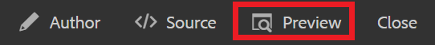

# コンテンツのバージョン管理

ドキュメントのバージョン管理では、現在の状態のスナップショットが作成されます。 複数のバージョンのトピックまたはマップを作成すると、変更を追跡し、古い作業を復元できます。

>[!VIDEO](https://video.tv.adobe.com/v/336724?quality=12&learn=on)

## 新しいバージョンの作成

1. 「新しいバージョンとして保存」アイコンを選択します。

   

   [ 新しいバージョンとして保存 ] ダイアログが表示されます。

1. 「新しいバージョンに対するコメント」フィールドに、変更の概要を簡潔かつ明確に入力します。
1. 「バージョンラベル」フィールドに、関連するラベルを入力します。

   ラベルを使用すると、公開時に含めるバージョンを指定できます。

   >[!NOTE]
   >
   >プログラムに事前定義済みのラベルが設定されている場合は、ラベル付けの一貫性を保つために、これらのラベルから選択できます。

1. 「**保存**」を選択します。

   トピックの新しいバージョンが作成され、バージョン番号が更新されました。 ドキュメントの最初のバージョンは、バージョン 1.0 になります。

## バージョン履歴の表示

コンテンツの複数のバージョンを作成したら、それらの違いを調べたい場合があります。

1. ツールバーの「バージョン履歴」アイコンを選択します。

   

   バージョン履歴ダイアログが表示されます。

1. 現在のバージョンと比較するには、ドロップダウンからバージョンを選択します。

   バージョン間の変更が示されます。

## 選択したバージョンに戻す

必要に応じて、バージョンを選択し、そのバージョンに戻すことができます。 これにより、現在のバージョンを破棄して、以前のバージョンの操作に戻ることができます。

1. バージョン履歴ダイアログで、元に戻すバージョンをドロップダウンから選択します。
1. 選択 **選択したバージョンに戻す**.

バージョンを元に戻すダイアログが表示されます。

1. 以前のバージョンに戻す理由についての説明コメントを追加します。
1. 選択 **確認**.

   トピックは特定のバージョンに戻されました。

## フィルターを使用したバージョンの比較

また、右側のパネルの追跡フィルターと差分を表示フィルターを使用して、プレビューのバージョンの違いを表示することもできます。

1. 選択 **プレビュー** をクリックします。

   

   トピックがプレビューで開きます。

1. 右側のパネルの「追跡」ドロップダウンで、「 **マークアップを表示**.
1. 「差分を表示」ドロップダウンで、比較するバージョンを選択します。

   変更は形式設定されたコンテンツとして表示されます。
