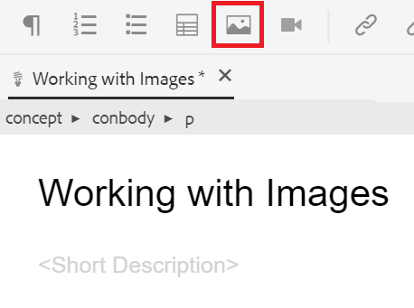

# 画像の操作

以下では、画像のアップロードと挿入、および新しいバージョンのトピックの保存方法について説明します。

サンプルの画像ファイルは、 [こちら。](assets/working-with-images/SignInScreen.png)

>[!VIDEO](https://video.tv.adobe.com/v/336661?quality=12&learn=on)

## 画像のアップロード

1. サブフォルダーにカーソルを移動し、省略記号アイコンを選択してオプションメニューを開きます。

   

1. 選択 **[!UICONTROL アセットをアップロード]**.

   

1. ローカルシステムからアップロードする画像を選択し、「 」を選択します。 **開く**.

   この [!UICONTROL アセットをアップロード] ダイアログボックスが表示されます。
1. 選択 **アップロード**.

## トピックへの画像の挿入

トピックに画像を挿入する方法は複数あります。

ローカルシステムからトピックに画像をドラッグ&amp;ドロップできます。 画像が既にアップロードされている場合は、左パネルからトピックに直接ドラッグ&amp;ドロップすることもできます。 または、「画像を挿入」ボタンを使用して、現在左側のレールに表示されていない画像を挿入し、さらに画像を挿入する前に画像を設定することもできます。

次の場合は、トピックがドキュメントエディターで開いていることを確認します。

### ドラッグ&amp;ドロップによる画像の挿入

1. ローカルシステムまたは左側のパネルから画像ファイルを選択し、トピックにドラッグ&amp;ドロップします。

   画像がエディターに表示されます。

### 「画像を挿入」ボタンを使用した画像の挿入

1. を選択します。 **画像を挿入** アイコン

   

   [ イメージの挿入 ] ダイアログボックスが表示されます。

1. 「ファイルを選択」フィールドの横にあるフォルダーアイコンを選択して画像を検索するか、リポジトリ内のその場所に移動します。
1. 画像のアイコンを選択し、 **選択**.

   

   [ イメージの挿入 ] ダイアログボックスが開き、選択したイメージの情報が表示されます。

1. 必要に応じて、[ 図のタイトル ] フィールドと [ 代替テキスト ] フィールドにテキストを入力します。
1. 選択 **挿入**.

   画像が、図のタイトルと共にエディターに表示されます。

## トピックからの画像の削除

1. ドキュメントエディターで画像を選択し、 **削除** キー。

## トピックの新しいバージョンの保存

バージョン管理を使用すると、様々なバージョンを確認および比較できます。 以前のバージョンに戻すこともできます。

トピックに大きな変更を加えたので、現在の作業を新しいバージョンとして保存すると便利です。

1. を選択します。 **新しいバージョンとして保存** アイコン

   

   この **新しいバージョンとして保存** ダイアログボックスが表示されます。

1. 「新しいバージョンに対するコメント」フィールドに、変更の概要を簡潔かつ明確に入力します。
1. 「バージョンラベル」フィールドに、関連するラベルを入力します。

   ラベルを使用すると、公開時に含めるバージョンを指定できます。
   >[!NOTE]
   > 
   > プログラムに事前定義済みのラベルが設定されている場合は、ラベル付けの一貫性を保つために、これらのラベルから選択できます。
1. 「**保存**」を選択します。

   トピックの新しいバージョンが作成され、バージョン番号が更新されました。
