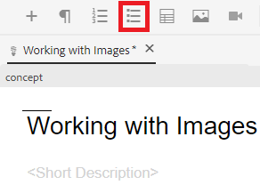
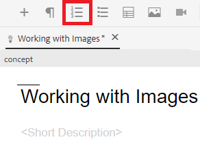

# リストの使用

情報を整理するには、箇条書きと番号付きのリストが必要になる場合があります。 次に、既存の概念内でリストを挿入して操作する方法を示します。

>[!VIDEO](https://video.tv.adobe.com/v/336658?quality=12&learn=on)

## 箇条書きリスト

箇条書きリストまたは順序なしリストは、リストコンポーネントを特定の順序で配置する必要がない場合に使用します。

### 箇条書きリストの挿入

1. を選択します。 **箇条書きリストを挿入** アイコンをクリックします。

   

   箇条書きが表示されます。 これがリストの先頭です。

1. 最初のリスト項目を入力します。
1. Enter キーを押して 2 つ目のエントリを作成し、コンテンツを入力します。
1. 必要に応じて、引き続きリスト項目を追加します。

## 番号付きリスト

番号付きリストは、リストコンポーネントの順序付けまたは構造化が特定の方法で必要な場合に使用します。

### 順序付きリストの挿入

1. を選択します。 **番号付きリストの挿入** アイコンをクリックします。

   

   数値が表示されます。 これがリストの先頭です。

1. 最初のリスト項目を入力します。
1. Enter キーを押して 2 つ目のエントリを作成し、コンテンツを入力します。
1. 必要に応じて、引き続きリスト項目を追加します。

## 新しいバージョンとして保存中

これで、コンセプトにコンテンツを追加したので、作業内容を新しいバージョンとして保存し、変更を記録することができます。

1. を選択します。 **新しいバージョンとして保存** アイコン

   

1. 「新しいバージョンに対するコメント」フィールドに、変更の概要を簡潔かつ明確に入力します。
1. 「バージョンラベル」フィールドに、関連するラベルを入力します。

   ラベルを使用すると、公開時に含めるバージョンを指定できます。

   >[!NOTE]
   > 
   > プログラムに事前定義済みのラベルが設定されている場合は、ラベル付けの一貫性を保つために、これらのラベルから選択できます。

1. 「**保存**」を選択します。

   トピックの新しいバージョンが作成され、バージョン番号が更新されました。
