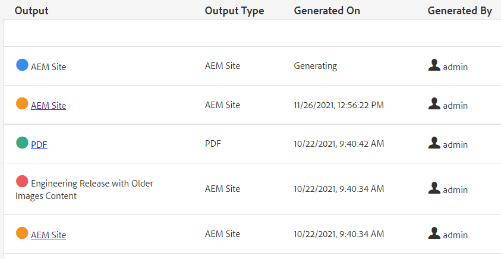

# 一括公開

公開時には、多くの場合、複数のタイプのドキュメントが必要です。 Map コレクションを使用して、アセンブルして生成し、一括公開を開始する出力の数と種類を制御できます。 公開ダッシュボードを使用すると、アクティブな公開ジョブを表示できます。 一括公開ダッシュボードを使用すると、コレクションを一括でアクティブ化できます。

>[!VIDEO](https://video.tv.adobe.com/v/338985?quality=12&learn=on)

## マップコレクションの操作

Map コレクションを使用すると、1 つ以上のマップに対して生成される出力のタイプを制御できます。

### Map コレクションを作成

1. ナビゲーションメニューで、 **Assets**.

1. 「コレクションをマッピング」を選択します。

1. 「**作成**」をクリックします。

1. コレクションのタイトルを入力します。

   

1. 「**作成**」をクリックします。
1. 成功メッセージを閉じます。

1. マップコレクションを開きます（タイルの下の灰色のセクションをクリックします）。

1. クリック **編集**.

1. 必要に応じてマップを追加します。

1. 選択または選択解除 **出力プリセット** 各マップに対して
1. 「**完了**」をクリックします。

### マッププリセットのフィルタリング

1. マッププリセットを開きます。

1. の下 **フィルター** 必要に応じて、オプションを展開して選択します。

### Map コレクションでのコンテンツの生成

1. マッププリセットを開きます。

1. 必要に応じて、 **すべて生成**.

1. または、生成するマップと出力タイプを選択し、 **選択した項目を生成**.

1. 必要に応じて、「出力」タブに切り替えます。

1. 出力を確認します。

## 公開ダッシュボードでのアクティブな公開ジョブの表示

公開ダッシュボードを使用すると、アクティブな公開ジョブを表示できます。 マップの動的なリストと現在のステータスが表示されます。 公開ワークフローを追跡、管理またはキャンセルできます。

1. ナビゲーション表示で、 **ツール** アイコン

1. 「**[!DNL Guides]**」をクリックします。

1. を選択します。 **ダッシュボードを公開** タイル。

       ダッシュボードが空白の場合、公開ジョブは実行されていません。
       
   
1. 必要に応じてダッシュボードをフィルタリングし、すべての公開ジョブを表示します。

### 一括公開ダッシュボードの操作

一括公開ダッシュボードを使用すると、一括アクティベーションコレクションを操作して、複数のタイプの出力を制御できます。

### 一括アクティベーションコレクションの作成

1. ナビゲーション表示で、 **ツール** アイコン

1. 「**[!DNL Guides]**」をクリックします。

1. を選択します。 **一括公開ダッシュボード** タイル。

1. コレクションのタイトルを入力します。

1. 「**作成**」をクリックします。

1. クリック **開く**.

1. マップコレクションを開きます（タイルの下の灰色のセクションをクリックします）。

1. クリック **編集**.

1. 必要に応じてマップを追加します。

1. 選択または選択解除 **出力プリセット** 各マップに対して
1. 「**完了**」をクリックします。
1. 完了したら、マップコレクションを閉じます。

### 一括アクティベーションコレクションのクイック公開

1. 「一括アクティベーションコレクション」タイルを選択します。
1. クリック **開く**.
1. 1 つ以上のマップを選択します。
1. クリック **クイック公開**.
