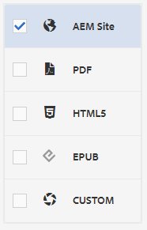

# ベースラインを使用した作成と公開

ベースラインを使用すると、マップトピックと関連する参照コンテンツのバージョンを作成できます。 特定の日時やラベルに基づくことができます。

>[!VIDEO](https://video.tv.adobe.com/v/338993?quality=12&learn=on)

## マップダッシュボードの「ベースライン」タブへのアクセス

「Map Dashboard」でベースラインにアクセスできます。

1. リポジトリ表示で、マップ上の省略記号アイコンを選択してオプションメニューを開き、 **Map ダッシュボードを開きます。**

   
別のタブにマップダッシュボードが開きます。

1. 選択 **基準**.

   

「ベースライン」タブが表示されます。

## ラベルに基づくベースラインの作成

1. 「ベースライン」タブで、 **作成**.

   

   新しいベースラインの情報が表示されます。 デフォルトの名前は、作成日に基づいて設定されます。

1. 必要に応じて、ベースラインに新しい名前を付けます。

1. 「バージョンの基準を設定」の見出しの下で、「ラベル」の円を選択します。
   

   >[!NOTE]
   >
   >注意：この *ラベルが存在しない場合は最新バージョンを使用* デフォルトでは、チェックボックスがオンになっています。 このオプションが選択されていない場合、選択したラベルのないトピックまたはメディアファイルがマップに存在すると、ベースライン作成プロセスは失敗します。

1. 使用するラベルを入力します。

1. 「**保存**」を選択します。

ベースラインが作成されます。 すべてのトピックとそれに関連する情報のテーブルが表示されます。

### 「すべてのトピックを参照」機能の使用

「すべてのトピックを参照」機能を使用すると、バージョンやラベルを含むトピックの情報を表示し、使用するバージョンを指定できます。 この機能には、「 **すべてのトピックを参照** ベースラインを作成または編集する際。

## 日時に基づくベースラインの作成

また、時間内のスナップショットであるベースラインを作成することもできます。

1. 「ベースライン」タブが開いていることを確認し、「作成」を選択します。

   

1. 「バージョンの基準を設定」の見出しの下で、「バージョンの基準」の円を選択します。

   

1. カレンダーアイコンを選択し、目的の日時を指定します。

   

1. 必要に応じて、ベースラインに新しい名前を付けます。

1. 「**保存**」を選択します。

ベースラインが作成されます。 すべてのトピックとそれに関連する情報のテーブルが表示されます。

### ベースラインへのラベルの追加

すべてのマップコンテンツに新しいラベルを一括で割り当てる必要がある場合があります。

1. ラベルを追加するベースラインを選択します。

1. 選択 **ラベルを追加**.

   

   [ ラベルを追加 ] ダイアログが表示されます。

1. 割り当てるラベルを入力し、「 」を選択します。 **追加**.

ラベルがすべてのトピックに追加されました。

## ベースラインを使用したAEM Site 出力の生成

1. Map ダッシュボードの「出力プリセット」タブに移動します。

1. 「 AEM Site 」チェックボックスをオンにします。

   

1. 「**編集**」を選択します。

   

   新しいページが表示されます。

1. 「ベースラインを使用」チェックボックスを選択し、使用するベースラインをドロップダウンから選択します。

   

1. 「**完了**」を選択します。

   

1. 選択 **生成**.

   

   出力はベースラインで生成されました。

## 生成された出力の表示

1. Map ダッシュボードの「出力」タブに移動します。

1. 「生成設定」列でテキストを選択して、出力を開きます。
   

## ベースラインの削除

1. 「ベースライン」タブで、削除するベースラインを選択します。

1. 選択 **削除**.

   

   [ 基準線を削除 ] ダイアログが表示されます。

1. 選択 **削除**.

ベースラインが削除されます。

## ベースラインの複製

1. 「ベースライン」タブで、複製するベースラインを選択します。

1. 選択 **複製**.

   

1. 「**保存**」を選択します。

   

重複したベースラインが作成されます。

## ベースラインの変更

ベースラインで使用するトピックのバージョンを直接指定できます。

1. 「ベースライン」タブで、変更するベースラインを選択します。
1. 「**編集**」を選択します。

   

1. 選択 **すべてのトピックを参照**.

   

   トピックのテーブルと、関連する情報が表示されます。

1. 変更するトピックについて、「バージョン」列の下にあるドロップダウンから目的のバージョンを選択します。

   

1. 「**保存**」を選択します。

変更は保存されました。 ベースラインは、指定したトピックのバージョンを使用します。

## カスタマイズされたAEM Site の出力プリセットの作成

「出力」タブでは、同じタイプのデフォルトの出力を区別するのが困難です。 カスタマイズされた出力プリセットを一意のわかりやすい名前で使用すると、この問題に対処できます。

この場合、ベースラインに基づいて出力プリセットを作成します。

1. Map ダッシュボードの「出力プリセット」タブに移動します。

1. 「**作成**」を選択します。

   

   新しい出力プリセットページが表示されます。このページには、「新規出力」という名前が付けられます。
1. 「設定名」フィールドに、わかりやすい名前を入力します。

1. 「ベースラインを使用」チェックボックスを選択し、ドロップダウンメニューから目的のベースラインを選択します。

   

1. 「**完了**」を選択します。

新しい出力プリセットが作成され、出力プリセットページに表示されます。
