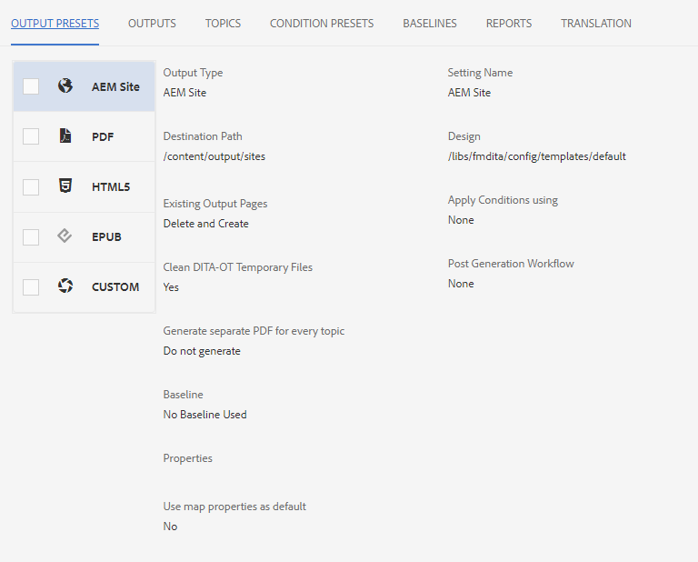
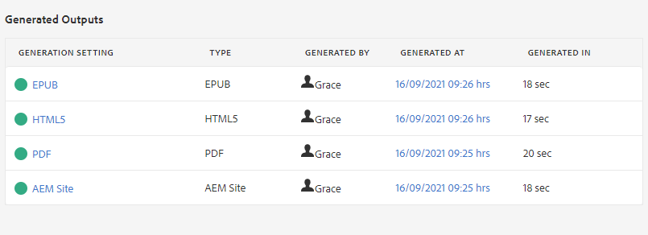
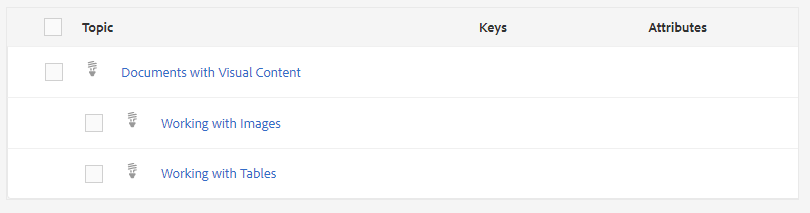
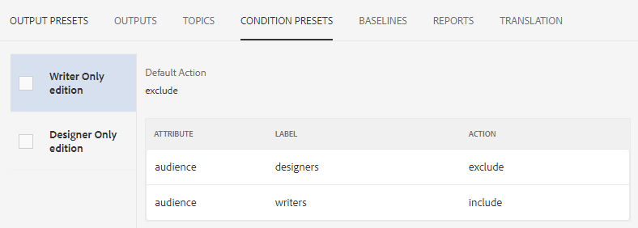
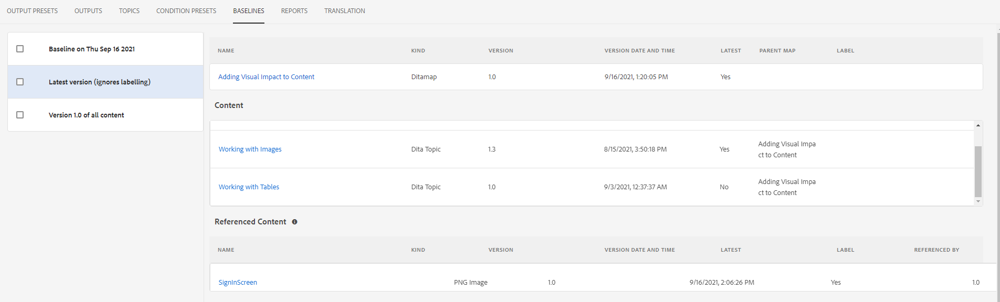

# Map ダッシュボードの概要

次に、マップダッシュボードの主な機能の概要を示します。

>[!VIDEO](https://video.tv.adobe.com/v/339040?quality=12&learn=on)

## マップダッシュボードでマップを開く

1. リポジトリ表示で、マップ上の省略記号アイコンを選択してオプションメニューを開き、「Open Map Dashboard」を選択します。
   

   別のタブにマップダッシュボードが開きます。

## マップダッシュボードのコンポーネント

「マップダッシュボード」には、出力プリセット、出力結果、使用するトピック、ベースラインなど、様々なタブが含まれています。

### 出力プリセット

「出力プリセット」タブには、様々なタイプの出力のデフォルトのプリセットが表示されます。AEMサイト、PDF、HTML5、ePubおよびカスタム。

出力プリセットを選択して、変換名、宛先パス、ベースライン、適用された条件など、設定の詳細を表示できます。

### 出力：

「出力」タブには、以前に生成された出力と現在生成されている出力がすべて表示されます。

「生成設定」列の下の緑の円は、出力が正常に生成されたことを示します。 この列のテキストはアクティブなハイパーリンクとして機能し、それらを選択して、生成された出力を開くことができます。 「タイプ」列の下のエントリは、出力タイプを示します。
また、出力を生成したユーザ名、生成日時、生成に要した時間など、その他の出力生成情報もここに表示されます。 生成中にエラーが発生した場合は、生成日時を「生成場所」列で選択して、エラーログを開き、確認できます。

### トピック

「トピック」タブには、マップ内のすべてのトピックのリストが表示されます。

トピックのチェックボックスを選択すると、追加のアクションを実行できます。 タグの編集、再生成、タグの表示、適用、非表示を行うことができます。

### 条件プリセット

「条件プリセット」タブには、含めるまたは除外する特定の条件付きコンテンツの設定が表示されます。

ここで、「ライターのみ」エディションのチェックボックスを選択すると、「デザイナー」ラベルを持つ「オーディエンス」属性を持つすべてのコンテンツを除外し、「ライター」ラベルを持つすべてのコンテンツを含む出力が生成されます。

### 基準

「ベースライン」タブでは、ベースラインを表示できます。

ベースラインは、時間内のスナップショットとして機能し、トピックとアセットのバージョンを作成して公開できます。 例えば、特定の日時にコンテンツをキャプチャするベースラインは、その時のそれぞれのバージョンに基づいて、あるトピックのバージョン 1.3 と、別のトピックの 1.0 を使用できます。
ベースラインが指定されていない場合、すべてのコンテンツの最新バージョンで出力が生成されます。

### レポート

「レポート」タブには、使用中のトピックの総数、トピック内の欠落している要素、ドキュメントの状態など、トピック情報の概要が表示されます。

トピックに要素がない場合は、行の右端の矢印を選択して、エントリを展開し、エラーに関する詳細を表示できます。
