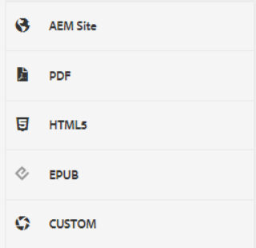
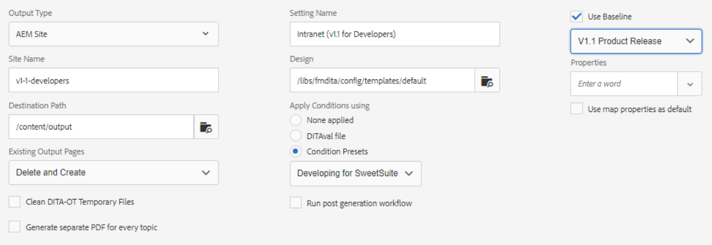

# 出力プリセット

出力プリセットは、マップに割り当てられたパブリッシュプロパティのコレクションです。 必要に応じて、これらを作成または変更できます。

>[!VIDEO](https://video.tv.adobe.com/v/338989?quality=12&learn=on)

## 出力プリセットへのアクセス

出力プリセットは、XML エディタでマップをマップダッシュボードで開くと表示されます。 プリセットには、特定の出力タイプ、宛先パス、既存の出力ページの管理方法に関する説明、出力を生成するためにマップに適用できるその他の設定に関する情報が含まれる場合があります。

## 出力プリセットの作成

>[!NOTE]
>
>注意：出力プリセットで使用される機能の一部は、最初にベースラインを作成するか、条件プリセットを作成するかに依存する場合があります。 これらが必要な場合は、適切なタブを使用して設定する必要があります。

1. ベースライン出力プリセットを選択します。 例えば、新しく作成するプリセットがサイト用の場合や、Adobe PDFコンテンツを提供する場合に、AEMまたはPDFを選択できます。

2. 「**作成**」をクリックします。

3. 必要に応じて、「出力タイプ」を選択します。

4. 出力タイプに応じて、さらにオプションを設定します。

5. 「**完了**」をクリックします。

## 出力プリセットの編集

出力プリセットは事前に定義されていますが、必要に応じてカスタマイズできます。

1. Map ダッシュボードを開きます。

2. を選択します。 **出力プリセット** タブをクリックします。

3. 出力プリセットを選択します。

4. 「**編集**」をクリックします。

5. 必要に応じて設定を変更します。

   

6. 「**完了**」をクリックします。
