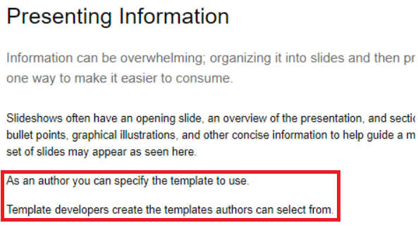
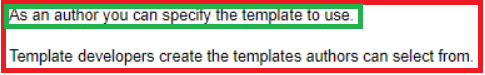
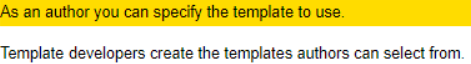
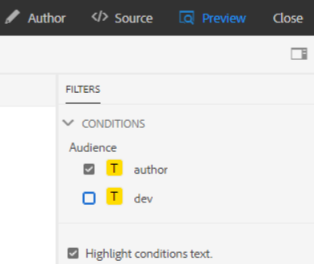
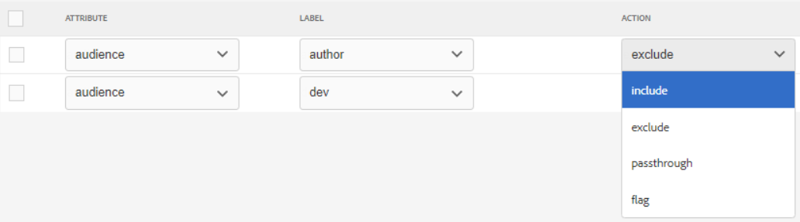
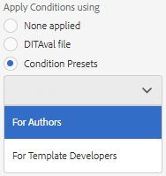
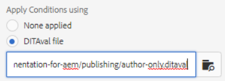

# 条件付きパブリッシュ

条件付き公開を使用すると、1 つ以上のオーディエンス、製品、プラットフォームに対して 1 つのコンテンツソースを書き込むことができます。 この情報は、動的に公開でき、出力に含める必要なコンテンツのみを具体的に指定できます。

>[!VIDEO](https://video.tv.adobe.com/v/339041)

## 練習の準備

演習用のサンプルファイルは、こちらからダウンロードできます。

[練習 — ダウンロード](assets/exercises/publishing-with-conditions.zip)

## 条件付き属性を含むコンテンツのマークアップ

1. 変更するトピックを開きます。

2. 条件付きにするテキストを入力します。 例えば、1 つ以上の段落、テーブル全体、図、その他のコンテンツなどです。

   

3. 条件付き属性を割り当てる特定のコンテンツを選択します。 例えば、ソース内の 1 つの段落が含まれます。

   

4. 右側のレールで、「プロパティ」が表示されていることを確認します。

5. オーディエンス、製品またはプラットフォームの属性を追加します。

6. 属性に値を割り当てます。 コンテンツ表示が更新され、条件付きマークアップが適用されていることを示します。

   

## 条件付きコンテンツのプレビュー

1. **プレビュー**&#x200B;をクリックします。

2. の下 **フィルター**、表示または非表示にする条件を選択または選択解除します。

3. 選択または選択解除 **条件テキストをハイライト**.

   

## 条件プリセットの作成

条件プリセットは、出力の生成時に含める、または除外する、またはマークアップする内容を定義するプロパティのコレクションです。

1. マップダッシュボードから、 **条件プリセット** タブをクリックします。

2. 「**作成**」をクリックします。

3. 選択 **追加** ( または **すべて追加**) をクリックします。

4. 条件に名前を付けます。

5. 属性、ラベル、アクションの組み合わせを選択します。

   

6. 必要に応じて繰り返します。

7. 「**保存**」をクリックします。

## 条件付き出力の生成

コンテンツに条件が適用されると、出力として生成できます。 条件プリセットまたは DITAval ファイルを使用できます。

## 条件プリセットを使用した条件付き出力の生成

1. を選択します。 **出力プリセット** タブをクリックします。

2. 出力プリセットを選択します。

3. 「**編集**」をクリックします。

4. の下 **次を使用して条件を適用** 「条件プリセット」を選択します。

   

5. 「**完了**」をクリックします。

6. 出力プリセットを生成し、コンテンツを確認します。

## DITAval ファイルを使用した条件付き出力の生成

DITAval ファイルは、条件付きコンテンツの公開に使用できます。 そのためには、ファイルを作成またはアップロードし、公開時に参照する必要があります。

1. を選択します。 **出力プリセット** タブをクリックします。

2. 出力プリセットを選択します。

3. 「**編集**」をクリックします。

4. 「次を使用して条件を適用」で、DITAval ファイルを選択します。

   

5. 「**完了**」をクリックします。

6. 出力プリセットを生成し、コンテンツを確認します。
