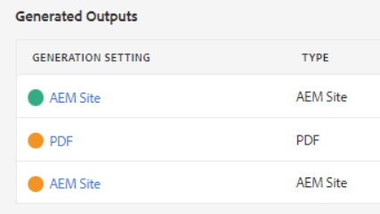
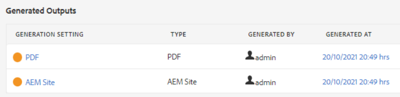
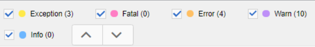

# 公開エラーのトラブルシューティング

通常、マップのパブリッシュは簡単です。 マップを開き、出力プリセットを選択して、出力を生成します。 ただし、マップまたはそのトピックにエラーがある場合、出力の生成に失敗する可能性があります。 この場合、トラブルシューティング方法を知ることが重要です。

>[!VIDEO](https://video.tv.adobe.com/v/338990?quality=12&learn=on)

## 練習の準備

演習用のサンプルファイルは、こちらからダウンロードできます。

[練習 — ダウンロード](assets/exercises/publishing-basic-to-advanced.zip)

## エラーの公開の一般的な原因

ソースコンテンツにエラーが含まれる場合があります。 例：

* ファイルパス参照の名前が正しくありません

* 名前が正しくありません

* グラフィックまたはファイルがありません

* 誤って設定されたコンテンツ参照

* 壊れた相互参照

* 属性の値のエラー（例：数値ではなく文字列）

* が使用するコンポーネントの設定が正しくありません [!DNL AEM Guides]

## エラーの影響

エラーの原因は軽微で、ファイルのパッケージ化に失敗したこと、または出力生成に完全に失敗したことを知らせる簡単なメモです。 「出力」タブには、出力生成に関連する成功、エラーまたは失敗を示す色分けされたアイコンが表示されます。

## エラーログを開き、確認する

生成されたログファイルを開いてレビューできます。

1. 内 **出力** タブで、 **「生成日」の日時。**

   

1. エラーログをスクロールします。

## エラータイプの表示と非表示

エラーログには、各エラータイプが一意の色で表示されます。

1. **選択** または **選択解除** ハイライトの表示/非表示を切り替える任意のエラータイプ。

1. 次を使用してエラーをナビゲートする **次へ** または **前** ボタン（矢印）

## エラーの解決

エラーのタイプに応じて、解決は単純でも複雑でもかまいません。 作成者が XML エディターで入力するか、管理者が [!DNL AEM Guides]. 具体的な修正は、エラー、影響、組織のワークフローによって異なります。

* ファイルパス参照の名前が正しくありません

       作成者は、ソースドキュメント内のパス参照を更新できます。
       
   
* 名前が正しくありません

       作成者は、必要に応じてフォルダー名を更新したり、ファイルを移動したりできます。
       
   
* グラフィックまたはファイルがありません

       作成者は、見つからないグラフィック/ファイルをアップロードしたり、グラフィック/ファイルの名前を変更したり、グラフィック/ファイルを移動したりできます
       
   
* 誤って設定されたコンテンツ参照

       作成者は、参照されるコンテンツの場所を修正したり、コンテンツ参照のパスを変更したりできます。
       
   
* 壊れた相互参照

       作成者は、相互参照が指す場所を修正したり、宛先ファイル名やプロパティを変更したりできます。
       
   
* 属性の値のエラー（例：数値ではなく文字列）

       作成者は、属性を正しい値に更新したり、管理者は新しい値に対応するようにシステムを更新したりできます。
       
   
* が使用するコンポーネントの設定が正しくありません [!DNL AEM Guides]

       管理者は、システム、そのコンポーネント、または権限のインストールを更新できます。
       
   