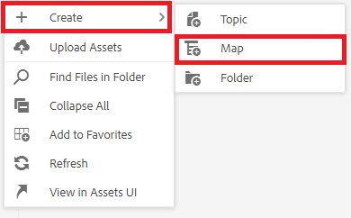

# レポートの操作

マップダッシュボードの「レポート」タブでは、壊れたリンク、参照して再利用 (conref) されたコンテンツ、相互参照、または他の欠落している情報を特定して解決できます。

>[!VIDEO](https://video.tv.adobe.com/v/339039?quality=12&learn=on)

## 練習の準備

演習用のサンプルファイルは、こちらからダウンロードできます。

[練習 — ダウンロード](assets/exercises/working-with-reports.zip)

## アセットのアップロード

1. リポジトリ表示で、メインフォルダーの省略記号アイコンを選択して、オプションメニューを開きます。

   

1. 選択 **[!UICONTROL アセットをアップロード]**.

   

1. フォルダーにアップロードするファイルを選択し、「 」を選択します。 **アップロード**.

DITA ファイルが開き、内容、conref、または相互参照が欠落している問題がないか確認してください。

## マップの作成

1. メインフォルダーの省略記号アイコンを選択して、オプションメニューを開きます。

   

1. 選択 **作成/マップ**.

   

   [ 新しいマップを作成 ] ダイアログボックスが表示されます。

1. 「テンプレート」フィールドで、「 **ブックマップ** ( または **マップ** 作成するコンテンツタイプに基づいて ) ドロップダウンメニューから選択し、マップにタイトルを付けます。

1. 「**作成**」を選択します。

マップが作成され、左側のレールがリポジトリビューからマップビューに自動的に変更されます。

## マップコンポーネントの挿入

1. 左側のレールで鉛筆アイコンを選択します。
これは編集アイコンで、マップをエディターで開くことができます。

   

1. リポジトリアイコンを選択して、リポジトリ表示に戻ります。

   

1. リポジトリからエディターのマップにトピックをドラッグ&amp;ドロップして、マップに追加します。
行インジケーターは、トピックが配置される場所を示します。

1. 必要に応じて、トピックの追加を続けます。

1. 終了したら、「 」を選択します。 **新しいバージョンとして保存します。**

   

1. 内 *新しいバージョンに関するコメント* 「 」フィールドに、説明的なコメントを入力します。

1. 「**保存**」を選択します。

## AEM Site 出力の生成

1. リポジトリで、マップ上の省略記号アイコンを選択してオプションメニューを開き、 **Map ダッシュボードを開きます。**

   

   別のタブにマップダッシュボードが開きます。
1. 「出力プリセット」タブで、「 **AEM Site**.

   

1. 選択 **生成**.

1. 出力ページに移動して、生成された出力のステータスを表示します。
エラーが発生した場合、「出力」タブで、「生成設定」列の下に緑色ではなくオレンジ色の円が表示され、生成が完了したことを示す場合があります。

1. 「生成設定」列の下のリンクを選択して、生成された出力を開きます。
出力をレビューして、見つからないコンテンツを調べます。

## 「レポート」タブ

「レポート」タブには、トピックの概要と、トピック情報およびマップ内の問題を含む表が表示されます。

コンテンツをインポートした後で、常にレポートでマップを確認するのが理想的です。

「見つからない要素」列に、見つからない画像の数と壊れた conref の数が表示されます。 次の項目を選択できます。 **鉛筆** アイコンをクリックし、エディターでトピックを開きます。

## 見つからない画像の解決

ファイルに画像がない場合は、コンテンツがアップロードされたが画像がアップロードされなかったことが一般的な原因である可能性があります。 その場合は、ファイルで想定されるパスとファイル名に一致する特定のフォルダーに画像をアップロードすることで、見つからない画像の問題を解決します。

1. In *リポジトリ表示*&#x200B;をクリックし、画像フォルダーの省略記号アイコンを選択して、オプションメニューを開きます。

   

1. 選択 **[!UICONTROL アセットをアップロード]**&#x200B;をクリックし、見つからない画像を選択します。

1. 選択 **アップロード**.

見つからない画像がアップロードされました。 現在は、新しく生成されたAEM Site の出力にこれらの画像が表示され、「レポート」タブに見つからない画像エラーは表示されなくなります。

## 壊れた conref の解決

参照先のコンテンツ (conref) が、別のフォルダ内のファイル（例えば、「reuse」という名前のコンテンツ）にリンクしている場合。 また、コンテンツがアップロードされない場合は、エラーを解決する必要があります。 例えば、「reuse」という名前のサブフォルダーを作成し、見つからないファイルを「reuse」にアップロードする必要があります。

### を使用したアセットのアップロード [!UICONTROL Assets] UI

また、 [!UICONTROL アセットをアップロード] 「 」オプションを使用すると、Assets UI にドラッグ&amp;ドロップしてアセットをアップロードできます。

1. リポジトリ表示で reuse フォルダーの省略記号アイコンを選択して、オプションメニューを開きます。

   

1. 選択 **Assets UI で表示**.

   

1. ファイルをフォルダーにドラッグ&amp;ドロップします。
ファイルがアップロードされ、conref エラーが解決されます。

すべてのエラーが解決されました。 レポートページには、これ以上エラーがないことが示されます。AEM Site を生成すると、見つからないコンポーネントを含む完全な出力が得られます。
