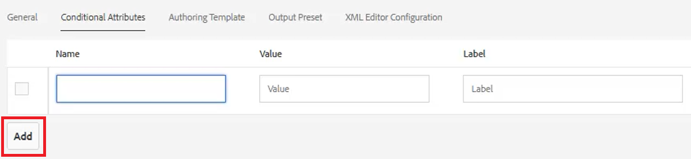
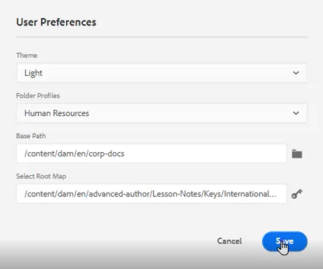
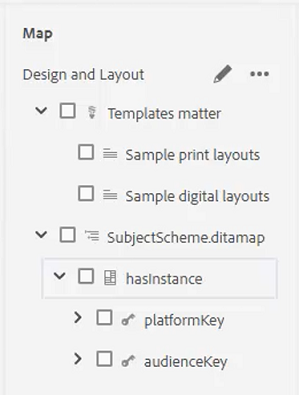
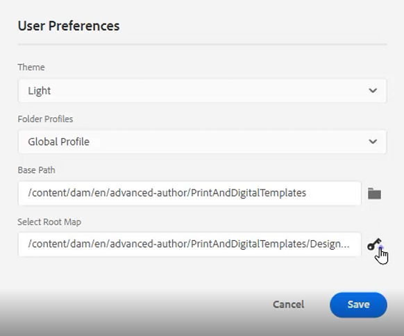

# 条件

DITA では、多くの場合、製品、プラットフォーム、オーディエンスなどの属性を通じて条件が駆動されます。 また、特定の値を割り当てることもできます。 ユーザーは、フォルダープロファイルを通じて、これらすべてを制御できます。

このレッスンで使用するサンプルファイルは、ファイルに記載されています [conditions.zip](assets/conditions.zip).

>[!VIDEO](https://video.tv.adobe.com/v/342755)

## フォルダープロファイルへの条件の割り当て

1. を選択します。 **フォルダープロファイル** タイル。

2. クリック [!UICONTROL **条件付き属性**].

3. クリック [!UICONTROL **編集**] をクリックします。

4. 「[!UICONTROL **追加**]」をクリックします。

   

5. 必須フィールドに入力します。

   ・ 「名前」は、プロファイルに使用される属性に対応している必要があります。

   ・値は、DITA コードソースで使用される正確なエントリです。

   ・ラベルとは、属性を入力するユーザーに表示される単語です。

6. 「[!UICONTROL **保存**]」をクリックします。

>[!NOTE]
>
>注意：グローバルプロファイルの設定は、一貫したスタイルガイドに従って属性と値の使用を制御する、初期の効率的な方法です。

## 要素に属性を割り当てる

カスタムフォルダープロファイルがコンセプトに割り当てられていない場合は、属性を特定の要素（段落など）に割り当てることができます。

1. 次の **リポジトリ表示**&#x200B;をクリックし、作業対象の要素をクリックして選択します。

2. 内 **コンテンツプロパティ** パネル、 [!UICONTROL **属性**] ドロップダウン。

3. 割り当てる属性を選択します。

4. を追加します。 **値**.

属性と値の組み合わせが、選択した要素に割り当てられます。

## 条件を使用して属性と値の組み合わせを割り当て

条件パネルでは、属性と値の組み合わせを制御して割り当てることができます。

1. を変更します。 **ユーザーの環境設定**.

   a.ユーザーの環境設定アイコンをクリックします。

   

   b.必須フィールドを **ユーザーの環境設定** ダイアログ。 次に例を示します。

   

   c.クリック [!UICONTROL **保存**].

2. 条件パネルから、「オーディエンスとプラットフォーム」のドロップダウンを展開します。 使用可能な条件は、フォルダープロファイルに固有です。

3. 条件を目的の要素にドラッグ&amp;ドロップして割り当てます。

## 件名スキームの割り当て

サブジェクトスキームマップは、特殊な形式のディタマップで、マップによって参照されます。 サブジェクト・スキームは、分類を定義するために使用します。 使用可能な値を制御できます。

1. 次に移動： **リポジトリ表示**.

2. [ 件名スキーム ] ダイアログボックスを参照するマップを選択します。 この例では、 _デザインとレイアウト_.

   

3. ユーザーの環境設定を指定します。

   a.次をクリック： [!UICONTROL **ユーザーの環境設定**] アイコン

   

   b.以下のフィールドに値を入力します。 **ユーザーの環境設定** ダイアログ。

   c. 「ベースパス」フィールドの横にあるフォルダー記号をクリックして、目的のファイルのパスを選択します。

   d.クリック [!UICONTROL **選択**].

   e.の横にあるキー記号をクリックします。 **ルートマップ** フィールドにパスを入力します。

   >[!IMPORTANT]
   >
   >重要：選択したルートマップは、サブジェクトスキームを含むマップである必要があります。

   

   f.使用するフォルダーを選択して、表示するアセットを制限します。

   g.クリック [!UICONTROL **選択**].

   h.クリック [!UICONTROL **保存**].

件名スキームが割り当てられました。

## 条件パネルから件名スキームを表示します。

1. に移動します。 **エディター設定**.

2. を選択します。 **条件** タブをクリックします。

3. 「 」ボックスをオンにします。 **条件パネルに件名スキームを表示**
