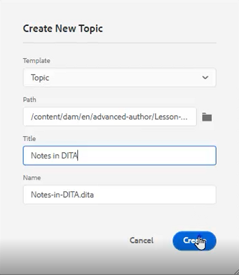

# コンテンツの再利用

DITA の主な機能の 1 つは、コンテンツの再利用機能です。 小さなフレーズからトピックやマップ全体にコンテンツを再利用できます。  ただし、コンテンツを効果的に再利用するには、適切に管理する必要があります。 再利用可能な情報を使用する際は、効果的なコンテンツ戦略を策定していることを確認します。

>[!VIDEO](https://video.tv.adobe.com/v/342757)

## 再利用可能なトピックの作成

再利用可能なソーストピックに変更を加えると、コンテンツが使用されている場所で情報が更新されます。

1. 次に移動： **リポジトリ**.

2. 次をクリック： **コンテキストメニュー** をクリックします。

3. 選択 **作成/Dita トピック**.

4. 新規トピックを作成ダイアログのフィールドに値を入力します。 次に例を示します。

   

5. 「[!UICONTROL **作成**]」をクリックします。

6. 必要に応じて、トピックにコンテンツを追加します。

## トピックに新しい再利用可能な要素を追加

再利用可能な要素を追加する方法はいくつかあります。 ここでは、1 つ目のワークフローは、1 つのコンポーネントのみを追加する場合に最適です。 2 つ目のワークフローは、複数の再利用可能なコンポーネントを追加する場合に適しています。

### ワークフロー 1

1. 有効な場所でトピック内をクリックします。

2. を選択します。 **再利用可能なコンテンツを挿入** アイコンをクリックします。

   

3. コンテンツを再利用ダイアログで、 [!UICONTROL **フォルダー**] アイコン

4. 必要なフォルダーに移動します。

5. 再利用可能なコンポーネントを含むトピックを選択します。
次に例を示します。

   

6. 「[!UICONTROL **選択**]」をクリックします。

7. 再利用する特定のコンポーネントを選択します。

8. 「[!UICONTROL **選択**]」をクリックします。

これで、再利用可能な要素がトピックに挿入されました。

### ワークフロー 2

1. に移動します。 **再利用可能なコンテンツ** をクリックします。

2. 次をクリック： [!UICONTROL **追加**] アイコンが表示されます。

   

3. フォルダーに移動します。

4. 特定のトピックを選択します。

5. 「[!UICONTROL **追加**]」をクリックします。

6. 再利用可能なコンテンツパネルから、を展開します。 **要素の概要**.

7. トピック内の有効な場所に要素をドラッグ&amp;ドロップします。

これで、再利用可能な要素がトピックに挿入されました。

## 要素に ID と値を割り当てる

先ほど作成した dlentry は再利用可能な要素です。 したがって、ID と値が必要です。

1. DL エントリ内をクリックします。

2. コンテンツプロパティパネルで、「属性」の下のドロップダウンをクリックします。

3. 選択 **ID**.

4. 値の論理名を入力します。

5. トピックを保存またはバージョン化して、変更がリポジトリに反映されるようにします。

ID と値が要素に割り当てられている。
