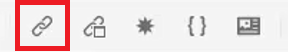
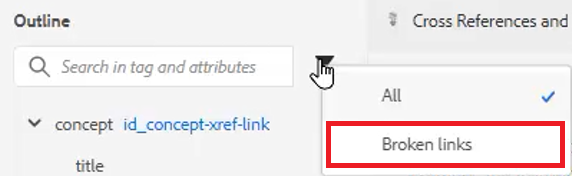

# 相互参照とリンク

XML Editor と DITA を使用すると、トピック間のリンクを強力に設定できます。 コンテンツ参照を効果的に管理することが重要です。これには、一意の ID 値の操作が含まれます。

このレッスンで使用するサンプルファイルは、ファイルに記載されています
[crossreferencesandlinks.zip](assets/crossreferencesandlinks.zip)

>[!VIDEO](https://video.tv.adobe.com/v/342764?quality=12&learn=on)

## 外部トピックへの相互参照の作成

トピックをリポジトリから開いているファイルにドラッグ&amp;ドロップして、外部の相互参照を作成できます。 ただし、相互参照の壊れを避けるためには、まず親要素に関連する値に ID を定義する必要があります。 これは、ID が正しく割り当てられていることを確認しながら、相互参照を簡単に作成する方法の 1 つです。

1. 外部相互参照を挿入するファイルを開きます。

1. 参照する要素に ID を割り当てます。

   a.要素内をクリックします。

   b.コンテンツプロパティパネルで、を選択します。 **ID** を選択します。

   c. 「値」フィールドに論理名を入力します。

   d.要素とその値をで表示する **アウトライン表示** 必要に応じて。

1. **保存** リポジトリに更新された ID が含まれていることを確認するためのトピックです。

1. 次をクリック： [!UICONTROL **参照**] アイコンをクリックします。

   

1. 次の **コンテンツ参照** 「 」タブで、相互参照として挿入する ID と要素の組み合わせを選択します。

1. クリック [!UICONTROL **選択**].

相互参照がトピックに追加されました。

## Web サイトへのリンク

任意のトピック内に Web サイトへのリンクを挿入できます。 詳しくは、Web サイトへのリンクに関するAEM Guides Course 1 のビデオを参照してください。

## 壊れたリンクを表示

一部の変更を行うと、クロスリファレンスが壊れる場合があります。 これには、トピックの削除、相互参照を含むセクションの再編成、相互参照の挿入後の ID の変更などが含まれます。 サンプルトピックに注意してください _crossreferencesandlinks.zip_ は、内部コンテンツへの複数のクロスリファレンスの箇条書きを壊すこのレッスンと共に提供されます。

1. 次に移動： **アウトライン表示** をクリックします。

1. 次をクリック： [!UICONTROL **フィルター**] アイコン

1. 選択 **リンク切れ**.

   

壊れたリンクは、クリック可能なオブジェクトとして表示されます。 トピック内で赤いテキストで識別できます。
