# XML エディター設定

制限が厳しい環境で作業する場合は、特定のフォルダープロファイル内でエディター設定をカスタマイズすることで、作成者が表示できる機能を選択できます。 このフォルダープロファイルを適用すると、エディター自体、CSS テンプレート、使用可能なスニペット、コンテンツバージョンラベルの外観を変更できます。

このレッスンで使用するサンプルファイルは、ファイルに記載されています [xmleditorconfiguration.zip](assets/xmleditorconfiguration.zip).

>[!VIDEO](https://video.tv.adobe.com/v/342762?quality=12&learn=on)

## デフォルトのエディター UI 設定をカスタマイズ

デフォルトの UI 設定は、いつでもローカルシステムにダウンロードし、任意のテキストエディターで変更して、再度アップロードできます。

1. ナビゲーション画面で、 [!UICONTROL **ツール**] アイコン

   

1. 選択 **ガイド** をクリックします。

1. 次をクリック： [!UICONTROL **フォルダープロファイル**] タイル。

   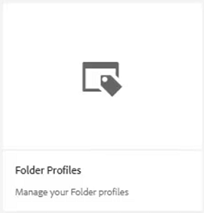

1. フォルダープロファイルを選択します。

1. 次をクリック： [!UICONTROL **XML エディター設定**] タブをクリックします。

1. クリック [!UICONTROL **ダウンロード**] デフォルト。

   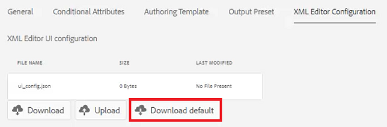

これで、テキストエディターでコンテンツを開いて変更できます。 この _AEM Guides のインストールと設定_ ガイドには、UI 設定を削除、カスタマイズ、または追加する方法のサンプルが含まれています。

## 変更した XML Editor UI 設定をアップロード

UI 設定をカスタマイズした後、アップロードできます。 サンプルの設定ファイルがあることに注意してください。 _ui-config-restricted-editor.json_ は、このレッスンで使用する一連のサポートトピックを備えています。

1. フォルダープロファイル内で、 [!UICONTROL **XML エディター設定**] タブをクリックします。

1. 「XML Editor UI configuration」で、 [!UICONTROL **アップロード**].

   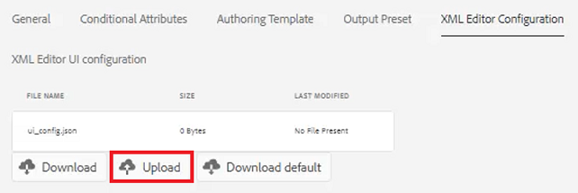

1. 変更した UI 設定のファイル（ここで示すサンプルファイル）をダブルクリックします。

   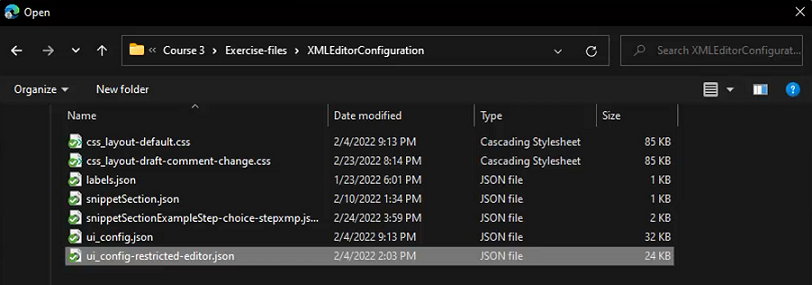

1. クリック [!UICONTROL **保存**] をクリックします。

変更した UI 設定が正常にアップロードされました。

## CSS テンプレートレイアウトのカスタマイズ

UI 設定と同様に、CSS テンプレートレイアウトをダウンロードできます。 テキストエディターで開き、変更を加えて、アップロード前にトピックのルックアンドフィールをカスタマイズすることができます。

1. ナビゲーション画面で、 [!UICONTROL **ツール**] アイコン

   

1. 選択 **ガイド** をクリックします。

1. 次をクリック： [!UICONTROL **フォルダープロファイル**] タイル。

   

1. フォルダープロファイルを選択します。

1. 次をクリック： [!UICONTROL **XML エディター設定**] タブをクリックします。

1. CSS テンプレートレイアウトで、 [!UICONTROL **ダウンロード**].

   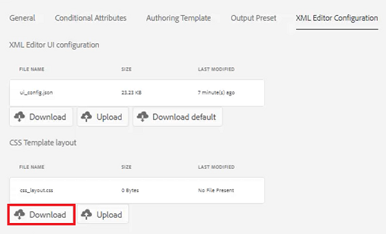

CSS コンテンツを変更してテキストエディターに保存できるようになりました。

## 変更した CSS テンプレートレイアウトをアップロードする

CSS テンプレートレイアウトをカスタマイズした後、アップロードできます。 サンプルファイル _css-layout-only-draft-comment-change.css_ は、このレッスンで使用する一連のサポートトピックを備えています。 このファイルには下書きコメントの変更のみが含まれていますが、 _css-layout-draft-comment-change.css_ はファイル全体で、テストやレビューの目的でのみ使用できます。

1. フォルダープロファイル内で、 [!UICONTROL **XML エディター設定**] タブをクリックします。

1. CSS テンプレートレイアウトで、 [!UICONTROL **アップロード**].

   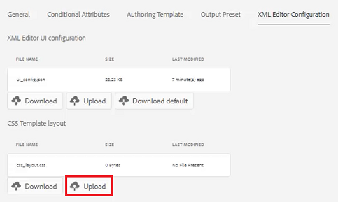

1. 独自のカスタム CSS レイアウトまたは用意されているサンプルファイルのいずれかのファイルをダブルクリックします。

   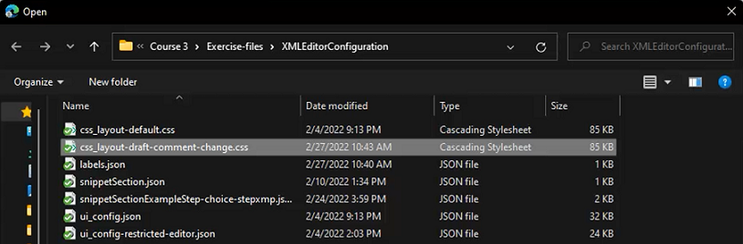

1. クリック [!UICONTROL **保存**] をクリックします。
カスタマイズされた CSS テンプレートレイアウトが正常にアップロードされました。

## XML エディタースニペットの編集

スニペットは、製品やグループに固有の再利用可能なコンテンツです。 サンプルスニペットには、このレッスンのサポートファイルが用意されています。

1. ナビゲーション画面で、 [!UICONTROL **ツール**] アイコン

   

1. 選択 **ガイド** をクリックします。

1. 次をクリック： [!UICONTROL **フォルダープロファイル**] タイル。

   

1. フォルダープロファイルを選択します。

1. 次をクリック： [!UICONTROL **XML エディター設定**] タブをクリックします。

1. [XML エディタスニペット ] で、 **アップロード**.

   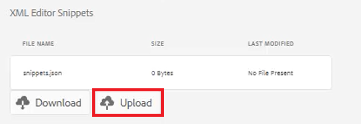

1. 独自のスニペットを選択するか、提供されるサンプルを使用します。

   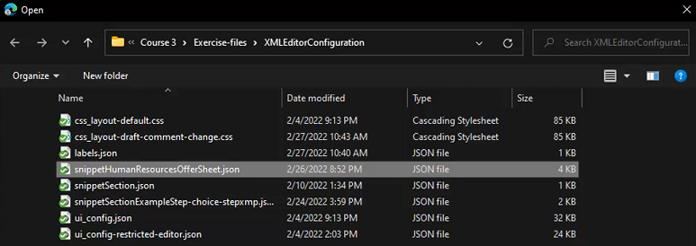

1. クリック [!UICONTROL **保存**] をクリックします。

新しいスニペットをエディターに正常に追加しました。

## XML コンテンツのバージョンラベルのカスタマイズ

デフォルトでは、作成者は、選択したラベルを作成し、トピックファイルに関連付けることができます。 同じラベルが異なるバリエーションになる場合があります。 ラベルの不一致を避けるために、事前定義されたラベルのリストから選択することもできます。

1. ナビゲーション画面で、 [!UICONTROL **ツール**] アイコン

   

1. 選択 **ガイド** をクリックします。

1. 次をクリック： [!UICONTROL **フォルダープロファイル**] タイル。

   

1. フォルダープロファイルを選択します。

1. 次をクリック： [!UICONTROL **XML エディター設定**] タブをクリックします。

1. 「XML Content Version Labels」で、 [!UICONTROL **ダウンロード**].

   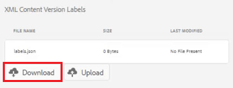

これで、必要に応じてラベルをカスタマイズする準備が整いました。

## XML コンテンツのバージョンラベルをアップロード

ラベルをダウンロードして変更したら、「 XML コンテンツバージョンラベル」トピックをアップロードできます。 サンプルファイルを使用することもできます _labels.json_（このレッスンで使用する一連のサポートトピック）

1. フォルダープロファイル内で、 [!UICONTROL **XML エディター設定**] タブをクリックします。

1. 「XML Content Version Labels」で、 [!UICONTROL **アップロード**].

   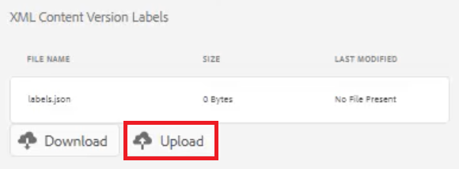

1. 独自のカスタムラベルまたはここに示すサンプルファイルのファイルをダブルクリックします。

   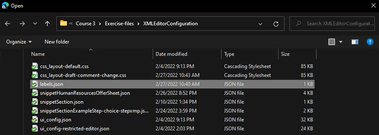

1. クリック [!UICONTROL **保存**] をクリックします。

カスタム XML コンテンツバージョンラベルを正常にアップロードしました。
