# フォルダープロファイル

AEMでは、設定ツールにすばやくアクセスできます。 フォルダープロファイルをカスタマイズすると、異なる部門や製品に、一意のテンプレート、オーサリング環境、条件付き属性プロファイル、スニペット、Web エディター設定を含めることができます。

このレッスンで使用するサンプルファイルは、ファイルに記載されています [folderprofiles.zip](assets/folderprofiles.zip).

>[!VIDEO](https://video.tv.adobe.com/v/342758)

## フォルダープロファイルにアクセス

設定は、フォルダープロファイルアイコンで管理されます。

1. ナビゲーション画面で、 [!UICONTROL **ツール**] アイコン

   

2. 選択 **ガイド** をクリックします。

3. 次をクリック： [!UICONTROL **フォルダープロファイル**] タイル。

   

4. 目的のプロファイルを選択します。 例えば、「 **グローバルプロファイル**：デフォルトのプロファイルです。

   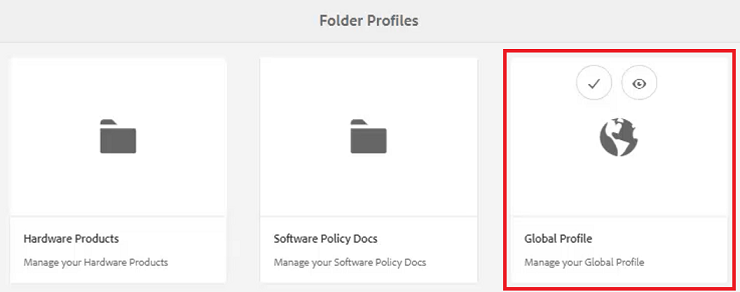

## グローバルプロファイルでの条件付き属性の編集

グローバルプロファイルにアクセスしたら、その設定を編集できます。 グローバルプロファイル設定は、特に指定のない限り、すべてのユーザーに適用されます。

1. グローバルプロファイルで、 **条件付き属性** タブをクリックします。

2. クリック [!UICONTROL **編集**] をクリックします。

   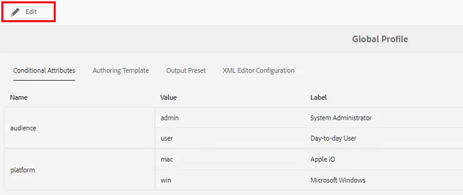

3. 「[!UICONTROL **追加**]」をクリックします。

4. 次の項目に **名前**, **値**、および **ラベル** 新しい条件のフィールド。

   

5. クリック [!UICONTROL **保存**] をクリックします。
これで、すべてのユーザーが新しい条件を使用できるようになりました。 コンテンツプロパティパネルで選択し、必要に応じてコンテンツに適用できます。

## 新しいフォルダープロファイルの作成

デフォルトのグローバルプロファイルに加えて、独自のカスタムプロファイルを作成できます。

1. ナビゲーション画面で、 [!UICONTROL **ツール**] アイコン

   

2. 選択 **ガイド** をクリックします。

3. 次をクリック： [!UICONTROL **フォルダープロファイル**] タイル。

   

4. 「[!UICONTROL **作成**]」をクリックします。

5. フォルダープロファイルを作成ダイアログで、

   a.プロファイルに名前を付けます。

   b.パスを指定します。

   c.クリック [!UICONTROL **作成**].

   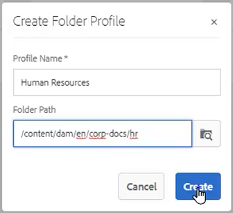

新しいプロファイル名を持つタイルがフォルダープロファイルページに表示されます。

## 「一般」タブから管理者ユーザーを追加します。

管理者ユーザーには、フォルダープロファイルの条件付き属性、オーサリングテンプレートおよび出力プリセットを更新する権限があります。

1. タイルをクリックして、目的のフォルダープロファイルを開きます。

   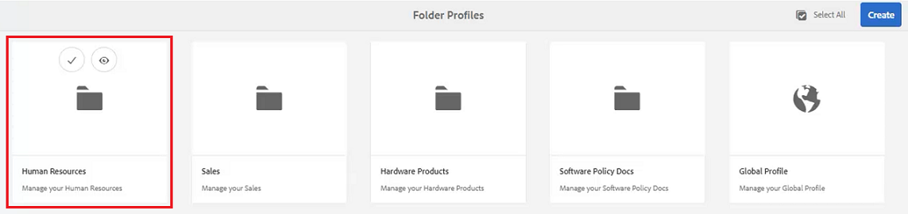

2. を選択します。 **一般** タブをクリックします。

3. クリック [!UICONTROL **編集**] をクリックします。

4. 「管理者ユーザー」で、ドロップダウンからユーザーを選択するか、ユーザー名を入力します。

5. 「[!UICONTROL **追加**]」をクリックします。

   必要に応じて、複数の管理者ユーザーを追加できます。

   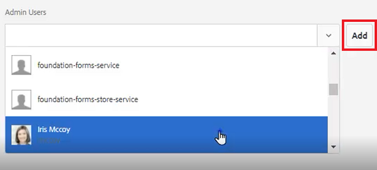

6. クリック [!UICONTROL **保存**] （すべてのユーザーが追加されている場合）

管理者ユーザーがこのプロファイルに割り当てられます。

## 「条件付き属性」タブからの新しいオーディエンスの追加

グローバルプロファイルにアクセスしたら、その設定を編集できます。 グローバルプロファイル設定は、特に指定のない限り、すべてのユーザーに適用されます。

1. 目的のフォルダープロファイル内から、 **条件付き属性** タブをクリックします。

2. クリック [!UICONTROL **編集**] をクリックします。

   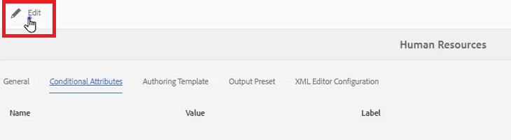

3. 「[!UICONTROL **追加**]」をクリックします。

4. 次の項目に **名前**, **値**、および **ラベル** 新しい条件のフィールド。

   クリック [!UICONTROL **プラス**] sign を使用すると、名前付き属性に値とラベルのペアを追加できます。

   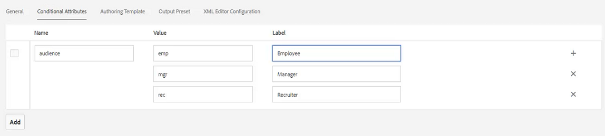

5. クリック [!UICONTROL **保存**] をクリックします。

新しい条件属性がこのプロファイルに追加されました。

## 「オーサリングテンプレート」タブからテンプレートとマップを選択します。

AEMガイドには、標準のオーサリングテンプレートとマップが付属しています。 これらを特定の作成者に制限できます。 デフォルトでは、テンプレートは DITA テンプレートフォルダー内の Assets の場所に保存されます。

1. 目的のフォルダープロファイル内から、「オーサリングテンプレート」タブを選択します。

2. 画面の左上隅にある「編集」をクリックします。

3. マップテンプレートを追加します。

   a.次の **マップテンプレート** ドロップダウンで、使用可能なマップからオプションを選択します。

   b.クリック [!UICONTROL **追加**].

   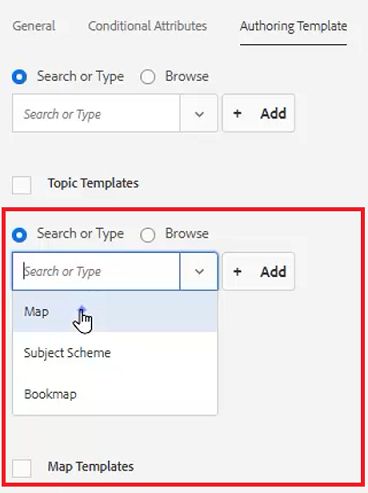

4. トピックテンプレートを追加します。

   a.次の **トピックテンプレート** ドロップダウンで、使用可能なテンプレートからオプションを選択します。

   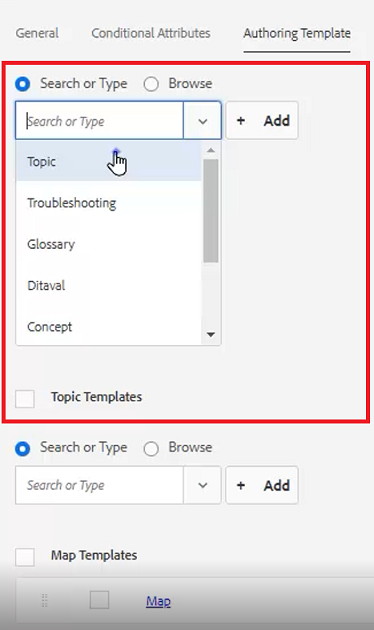

5. 「[!UICONTROL **追加**]」をクリックします。

6. 必要に応じて、トピックテンプレートを追加します。

7. 終了したら、 [!UICONTROL **保存**] をクリックします。

新しいオーサリングテンプレートがこのプロファイルに追加されました。

## 「出力プリセット」タブから不要なプリセットを削除します。

フォルダープロファイルに基づいて、各出力プリセットを設定できます。 不要な出力プリセットは削除する必要があります。

1. 目的のフォルダープロファイル内から、 **出力プリセット** タブをクリックします。

2. 左側のパネルで、不要なプリセットのチェックボックスをオンにします。

   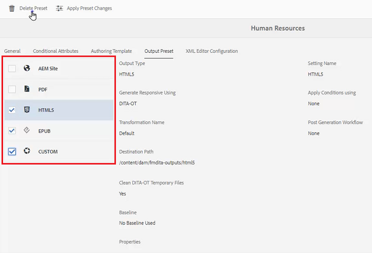

3. クリック [!UICONTROL **プリセットを削除**] をクリックします。

4. プリセットを削除ダイアログで、 [!UICONTROL **削除**].

   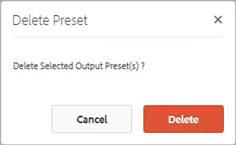

現在は、使用される出力プリセットのみが表示されます。

## 「XML Editor Configuration」タブからスニペットをアップロードします。

1. 目的のフォルダープロファイル内から、 **XML エディター設定** タブをクリックします。

2. [XML エディタスニペット ] で、 [!UICONTROL **アップロード**].

   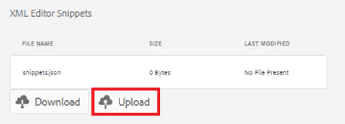

3. 以前に作成したスニペットに移動します。

4. クリック [!UICONTROL **開く**].

5. クリック [!UICONTROL **保存**] をクリックします。

スニペットを含めるようにエディター設定を変更しました。

## リポジトリでのフォルダープロファイルの指定

エディターで、フォルダープロファイルに対して行った変更の結果を表示できます。

1. に移動します。 **リポジトリ表示**.

2. 操作するコンテンツのフォルダーをクリックします。

3. 次をクリック： [!UICONTROL **ユーザーの環境設定**] アイコンをクリックします。

   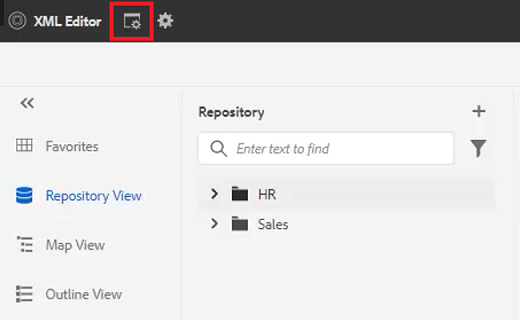

4. ユーザーの環境設定ダイアログで、ドロップダウンから目的のフォルダープロファイルを選択します。

   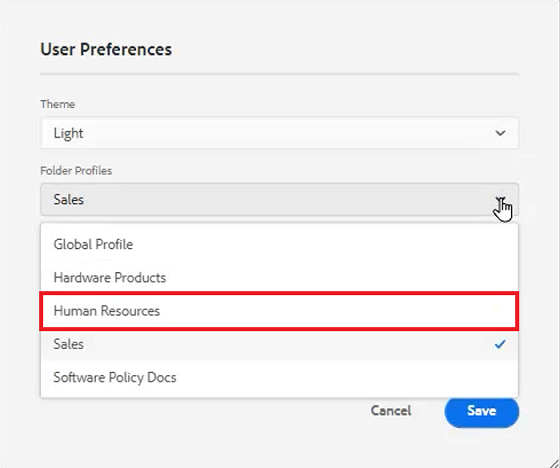

5. 「[!UICONTROL **保存**]」をクリックします。

コンテンツにフォルダープロファイルを適用しました。 新しい DITA トピックを作成すると、フォルダープロファイルに基づいて、トピックタイプの制限付きリストが表示されます。 Audience Condition には、グローバル設定に加えて、フォルダープロファイルに固有の設定も含まれます。 アップロードしたスニペットファイルには、デフォルトのスニペットのセットが作成されています。 マップダッシュボードには、制限された出力プリセットが表示されます。
