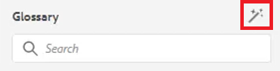

# 用語集

用語集パネルを使用すると、マップを解析できます。 用語集トピックファイルを作成し、共通の用語集マップに含めることができます。 このマップを他のマップに追加できます。 用語集を使用すると、情報を一貫して表現しやすくなり、読者にわかりやすくなります。

このレッスンで使用するサンプルファイルは、ファイルに記載されています [glossary.zip](assets/glossary.zip).

>[!VIDEO](https://video.tv.adobe.com/v/342765?quality=12&learn=on)

## トピックに用語集エントリを追加する

1. 次に移動： **用語集** パネル。

2. エントリを **用語集** をトピック内の目的の場所に追加します。

マップに用語集エントリが含まれ、正しく設定されている場合は、トピックを自動的に更新して短縮形式を含めることができます。

## ルートマップの指定

用語集を正しく機能させるには、正しいルートマップを選択する必要があります。 ルートマップが用語集エントリを検出すると、それらは用語集パネルに表示されます。

1. トピックを開いた状態で、「 」を選択します。 **用語集** を左側のパネルからクリックします。

2. 次をクリック： [!UICONTROL **ユーザーの環境設定**] アイコンをクリックします。

   

3. キーアイコンをクリックして、用語集を操作するための正しいルートマップを指定します。

4. 「[!UICONTROL **選択**]」をクリックします。

5. 「[!UICONTROL **保存**]」をクリックします。

用語集パネルが自動的に更新されます。

## 用語集の操作

1. 次に移動： **リポジトリ表示**.

2. 用語集を使用するように事前に設定されたマップを選択します。

   

3. を選択します。 [!UICONTROL **マップビュー**].

4. [ マップビュー ] に必要なトピックが表示されていることを確認します。

## グロッセントリのプレビュー

一括変更をおこなうことができるので、glossentry のプレビューが重要になる場合があります。

1. 選択 **用語集** を左側のパネルからクリックします。

2. glossentry の横にあるコンテキストメニューをクリックし、「 」を選択します。 [!UICONTROL **プレビュー**].

省略形と用語集の定義の両方が表示されます。

## ホットスポットツール設定の確認

ホットスポットツールを使用して、1 つのマップから用語集エントリのコレクション全体を作成します。 特定のテキスト用語を検索し、リンクされた用語集の略語に変換することもできます。

1. 用語集パネルで、 [!UICONTROL **ホットスポットアイコン**].

   

2. 次をクリック： [!UICONTROL **用語集キー**] ドロップダウンで、適用するキーのみを選択します。

3. 次をクリック： [!UICONTROL **トピック**] ドロップダウンを使用して、影響を受けるコンテンツを選択します。

4. 次をクリック： [!UICONTROL **トピックをステータスでフィルター**] ドロップダウンで設定済みのオプションを確認します。

5. 必要に応じて、残りの設定を指定します。

6. 終了したら、 [!UICONTROL **変換**].

用語集パネルに、更新されたすべてのトピックと、エラーが発生したトピックが表示されるようになりました。
