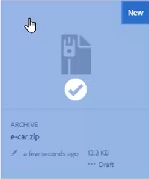
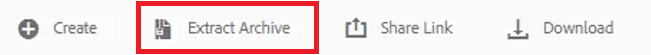
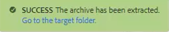
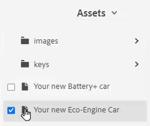
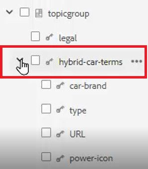
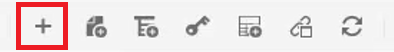
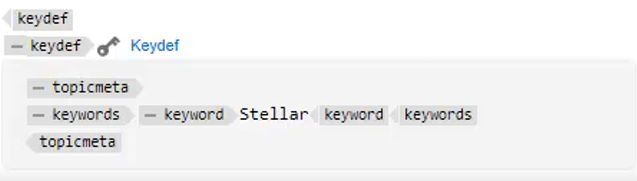

# キー

異なるマテリアルのセットには、選択した場所でカスタマイズする必要がある類似の情報が含まれる場合があります。 キーを使用すると、DITA の操作時に変数情報をに含めることができます。

このレッスンで使用するサンプルファイルは、ファイルに記載されています [keys.zip](assets/keys.zip).

>[!VIDEO](https://video.tv.adobe.com/v/342756?quality=12&learn=on)

## キーを有効にする

1. 提供されたサンプルファイルのセットをアップロードします。

   a.zip ファイルを読み込みます。

   b.AEM環境を更新します。

   c.抽出するファイルを選択します。

   

   d.クリック [!UICONTROL **アーカイブを抽出**] をクリックします。

   

   e.ダイアログで、Keys というフォルダなど、抽出するファイルの特定の場所を選択します。

   f.クリック [!UICONTROL **次へ**].

   g.これまでにアップロードされたことのないコンテンツに競合が存在しないので、競合をスキップします。

   h.選択 [!UICONTROL **抽出**] をクリックします。

2. 抽出が完了したら、 [!UICONTROL **ターゲットフォルダーに移動**].

   

## キーを参照値に解決

キーを正しく使用するには、ユーザの環境設定で特定のマップをルートマップとして参照する必要があります。 このマップ内にはキーのコレクションが含まれ、トピックグループ内にグループ化されます。 マップを開き、トピックでは、キーがこのマップが参照する値に解決されます。

1. ルートマップを指定します。

   a.キー画面で、マップを開きます。

   b.ユーザーの環境設定を指定します。

   c. [!UICONTROL **ユーザーの環境設定**] アイコンをクリックします。

   

   d.キーアイコンをクリックして、 **ルートマップ** これはキーの解決に使用されます。

   e.目的のアセットのチェックボックスをオンにします。

   

   f.クリック [!UICONTROL **選択**].

   g. **保存** ユーザーの環境設定

2. 次に移動： **マップビュー**.

3. 指定したマップを開きます。

キーが解決されます。

## 新しい keydef を手動で追加

1. 指定したルートマップでマップを開きます。

2. キーを選択します。

   

3. 新しい keydef を挿入します。

   a.マップ内の有効な場所をクリックします。

   b.を選択します。 **キー定義** アイコンをクリックします。

   

   c. [ キー定義を挿入 ] ダイアログで、作成する定義に対して意味のあるキーの一意の値を入力します。

   d.クリック [!UICONTROL **挿入**].

4. keydef 内に topicmeta を追加します。

   a.次をクリック： [!UICONTROL **要素を挿入**] アイコンをクリックします。

   

   b.[ 要素を挿入 ] ダイアログで、[topicmeta] を検索して選択します。

5. トピックメタ内にキーワードを追加します。

   a.次をクリック： [!UICONTROL **要素を挿入**] アイコンをクリックします。

   

   b.要素を挿入ダイアログで、「キーワード」を検索して選択します。

6. トピックメタ内にキーワードを追加します。

   a.次をクリック： [!UICONTROL **要素を挿入**] アイコンをクリックします。

   

   b.内 **要素を挿入** ダイアログ、検索、「キーワード」を選択

7. キーワードに keydef の値を入力します。

マップでは、keydef は次のようになります。

## スニペットとしての keydef の設定

スニペットは、ドキュメントプロジェクトの様々なトピック間で再利用できる小さなコンテンツフラグメントです。 各 keydef を手動で生成する代わりに、1 つの keydef をスニペットとして設定できます。

1. マップで keydef 要素を選択します。

2. コンテキストメニューで、 [!UICONTROL **スニペットを作成**].

3. 新規スニペットダイアログで、タイトルと説明を追加します。
また、既存のキーやキーワードの定義をコンテンツから削除することもできます。

4. 「[!UICONTROL **作成**]」をクリックします。

5. 左側のパネルで、を選択します。 **スニペット**.

6. 作成したスニペットをスニペットパネルからマップにドラッグ&amp;ドロップします。

7. 必要に応じて、コンテンツプロパティを使用して keydef を更新します。
保存して更新すると、同じルートマップを含むマップを定義したユーザに対して、このキーのセットが使用可能になります。
