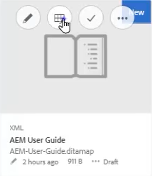
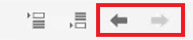
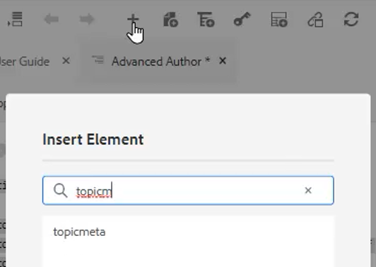
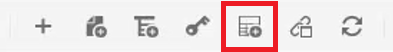
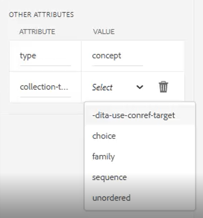

# マップとブックマップ

Adobe Experience Managerガイドのマップエディタを使用すると、マップファイルを作成および編集できます。 マップエディタを使用して、DITA マップとブックマップの 2 種類のファイルを編集できます。 私たちの目的では、これらを大きく取り替え可能な概念と考えてください。
[ マップエディタ ] には、[ 基本マップエディタ ] と [ 高度なマップエディタ ] の 2 つのモードがあります。

>[!VIDEO](https://video.tv.adobe.com/v/342766?quality=12&learn=on)

## マップを作成する

AEMガイドには、すぐに使用できる 2 つのマップテンプレート（DITA マップとブックマップ）が用意されています。 また、独自のマップテンプレートを作成し、作成者と共有してマップファイルを作成することもできます。

次の手順を実行して、マップファイルを作成します。

1. Assets UI で、マップファイルを作成する場所に移動します。

2. クリック [!UICONTROL **作成/DITA マップ**].

3. ブループリントページで、使用するマップテンプレートのタイプを選択し、 [!UICONTROL **次へ**].

4. プロパティページで、 **タイトル** および **名前** 地図の。

5. 「[!UICONTROL **作成**]」をクリックします。

## [ 高度なマップエディタ ] を使用してマップを開く

1. 内 **Assets UI**、編集するマップを選択します。

2. クリック [!UICONTROL **トピックを編集**].

   

または

1. マップアイコンの上にマウスを置きます。

2. 選択 **トピックを編集** から **アクション** メニュー

## マップまたはブックマップへのコンテンツの追加

1. 次に移動： **リポジトリ表示**.

2. リポジトリビューから、マップまたはブックマップ内の有効な場所にコンテンツをドラッグ&amp;ドロップします。

または

1. マップまたはブックマップ内の有効な場所をクリックします。

2. 該当する [!UICONTROL **ツールバーアイコン**] 章、トピックまたは topicref を追加します。

   

3. 追加する 1 つ以上のアセットを選択します。

4. 「[!UICONTROL **選択**]」をクリックします。

### マップ内の要素の昇格または降格

用途 **ツールバーの矢印** ：マップまたはブックマップ内のチャプターおよび topicref を昇格または下降させます。

1. マップ内の要素を選択します。

2. 次をクリック： [!UICONTROL **左向き矢印**] トピック参照をチャプターにプロモーションする場合、または [!UICONTROL **右矢印**] をクリックして、章を topicref に降格します。

   

3. 必要に応じて、マップを保存し、バージョンを設定します。

または

1. 要素をドラッグ&amp;ドロップして再編成します。

## マップへのメタデータの追加

1. 次の **マップツールバー**、topicgroup を挿入します。

   

2. 次をクリック： [!UICONTROL **プラスアイコン**] をクリックして要素を挿入します。

3. 挿入する要素を選択します。

   

4. 「[!UICONTROL **閉じる**]」をクリックします。

## マップへの関連付け可能な追加

マップを構造化した後に、関連付け可能なを追加できます。

1. 関連付け可能テーブルを挿入するマップ内をクリックします。

2. 以下を使用： **ツールバーアイコン** をクリックして、関連付け可能なをマップに追加します。

   

3. ダイアログを設定します。

4. クリック [!UICONTROL **挿入**].

5. 必要なトピックを **リポジトリ** 関係のあるテーブルに

6. 標準のキーボードショートカットを使用して、マップから必要な要素を関連付け可能なにコピー&amp;ペーストします。

## マップ内の topicrefs に属性を割り当てます。

1. マップ内の topicref またはネストされた topicrefs のコレクションをハイライトします。

2. コンテンツプロパティパネルの「その他の属性」で、 **属性** および **値。**

   
