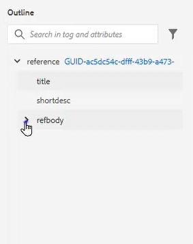
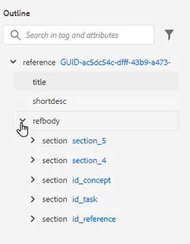
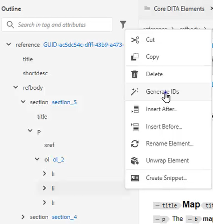
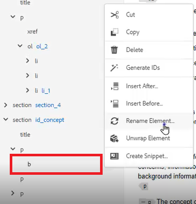
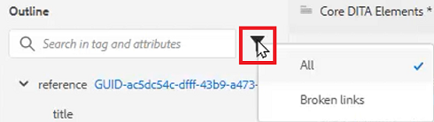
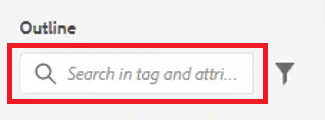

# アウトライン表示

アウトラインビューでは、構造化ドキュメントを使用する場合に幅広いサポートを提供します。 ビューを展開および折りたたみ、構造をナビゲートし、属性を使用して（例えば、新しい ID を作成する）、ボタンをクリックすると、要素の再編成、展開、再構築をおこないます。

>[!VIDEO](https://video.tv.adobe.com/v/342767)

## アウトライン・ビューの展開と折りたたみ

要素を展開して子要素を表示したり、必要に応じて折りたたんだりできます。

1. 該当するアイコンをクリックして、アウトライン・ビューを展開または折りたたみます。

   

   

アウトライン・ビューが展開から折りたたまれます。

## アウトライン・ビューを使用したナビゲーション

1. 任意の要素をクリックすると、その場所にジャンプします。

2. 次をクリック： [!UICONTROL **省略記号**] 要素の横にあるをクリックして、ショートカットオプションにアクセスします。

   

## アウトライン・ビューを使用した ID の割り当て

新しい ID は、システム設定に基づいて自動的に生成できます。 必要に応じて、コンテンツのプロパティを使用して、ID とその値を更新することもできます。

1. 次をクリック： [!UICONTROL **省略記号**] をクリックします。

2. 選択 **ID の生成**.

   

ID が割り当てられます。 コンテンツプロパティが更新され、要素と属性の情報が表示されます。

## ドラッグ&amp;ドロップを使用して要素を再構成

要素は、アウトライン・ビュー内で並べ替えることができます。

1. 要素をクリックし、アウトライン・ビューの別の場所にドラッグします。

2. 要素を別の要素の上にドロップして置き換えます。 この操作は、置き換える要素の周囲に四角いボックスで示されます。

   または

   他の 2 つの要素の間に要素をドロップして、位置を変更します。 このアクションは、新しい要素がドロップされる要素間の線で示されます。

## 要素名の変更

1. 要素を選択します。

2. 次をクリック： [!UICONTROL **省略記号**].

3. 選択 **要素名を変更**.

   

4. 新しい要素名をダブルクリックします。

要素の名前が変更されました。

## 要素のアンラップ

1. 展開する要素を選択します。

2. 次をクリック： [!UICONTROL **省略記号**].

3. 選択 [!UICONTROL **要素を展開**].

コンテンツは残りますが、構造は削除されました。

## アウトラインビューを使用したコンテンツのフィルタリング

1. 次をクリック： [!UICONTROL **フィルター**] アウトライン・ビューの検索バーの横にあるアイコン

   

2. 次のいずれかを選択 **すべて** すべての要素を表示するか、 **リンク切れ** 壊れた参照を検索して修正する。

## アウトラインビューで検索

検索は、要素、属性または値に基づいて制限し、結果を返すことができます。

1. 検索バーに検索する要素の名前を入力します。

   

2. ニーズに最も関連した結果を選択します。
