# パネル

AEM Guides Web Editor は、メインツールバー、セカンダリツールバー、左パネル、コンテンツ編集領域、右パネルなど、複数のセクションに分かれています。

>[!VIDEO](https://video.tv.adobe.com/v/342760?quality=12&learn=on)

## 左のパネルのサイズを変更する

左パネルなどの持続的なパネルのサイズは調整可能です。

1. パネルの境界線にカーソルを置きます。

1. 二重矢印が表示されたら、必要に応じて内側または外側にドラッグします。

## 左のパネルのサイドバーを展開または折りたたむ

展開されたビューには、折りたたまれたビューでツールチップとして表示される名前とアイコンが表示されます。

1. 次をクリック： [!UICONTROL **サイドバー**] アイコンをクリックしてパネルを展開します。

   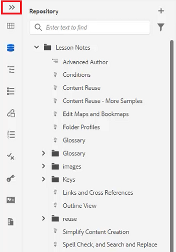

1. 次をクリック： [!UICONTROL **サイドバー**] アイコンを再度クリックして、パネルを折りたたみます。

   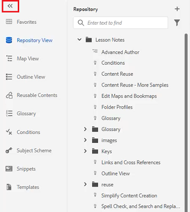

## お気に入りコレクションを作成する

左側のパネルで、お気に入りを使用すると、特定のドキュメントのリストを作成し、時間の経過と共に追加できます。 お気に入りの幅広いコレクションを作成および管理できます。

1. 選択 **お気に入り** をクリックします。

1. 次をクリック： [!UICONTROL **プラス**] アイコン

   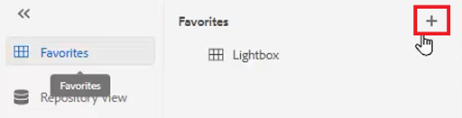

1. 新しいコレクションダイアログで、 **タイトル** および **説明**.

   「公開」を選択すると、他のユーザーがこのお気に入りを表示できることに注意してください。

1. 「[!UICONTROL **作成**]」をクリックします。

お気に入りコレクションが作成されました。

## リポジトリからお気に入りコレクションにファイルを追加する

コレクションを作成した後、そのコレクションにお気に入りを追加できます。

1. 選択 **リポジトリ表示** をクリックします。

1. 次をクリック： [!UICONTROL **省略記号**] トピックの横にある「 」をクリックして、コンテキストオプションにアクセスします。

1. 選択 **追加先** > **お気に入り**.

1. お気に入りに追加ダイアログで、 **新しいコレクション** または **既存のコレクション**.

   ここでは、既存のコレクションに追加することを選択します。

   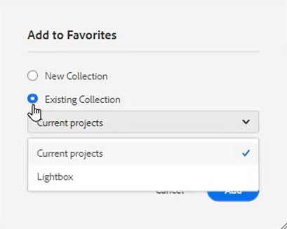

1. 必要に応じて、ドロップダウンからコレクションを選択します。

1. 「[!UICONTROL **追加**]」をクリックします。

選択したお気に入りコレクションにトピックが追加されます。 お気に入りメニューで表示できます。

## エディターからお気に入りコレクションにファイルを追加する

お気に入りにトピックを追加する別の方法は、エディターで開いているトピックからの方法です。

1. 次に移動： **リポジトリ表示**.

1. トピックをダブルクリックして開きます。

1. ファイルの **「タイトル」タブ** をクリックして、コンテキストオプションにアクセスします。

1. 選択 **追加先** > **お気に入り**.

   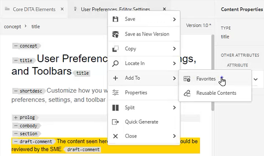

1. お気に入りに追加ダイアログで、 **新しいコレクション** または **既存のコレクション**.

   ここでは、新しいコレクションに追加を選択します。

1. 新しいコレクションダイアログで、 **タイトル** および **説明**.

   なお、「 **公開** は、他のユーザーがこのお気に入りを表示できることを意味します。

1. 「[!UICONTROL **作成**]」をクリックします。

新しいお気に入りが作成され、グループ化されました。 お気に入りメニューで表示できます。

## お気に入りの表示と管理

お気に入りコレクションに追加済みのトピックを簡単に表示できます。

1. 選択 [!UICONTROL **お気に入り**] をクリックします。

1. [ お気に入り ] で、 [!UICONTROL **矢印**] コレクションの横にあるアイコンで、そのコンテンツを表示します。

   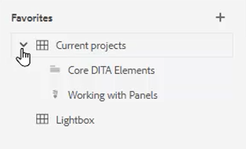

1. 次をクリック： [!UICONTROL **省略記号**] トピックの横に、お気に入りリストから削除するオプションなど、コンテキストオプションが表示されます。

## リポジトリ表示での検索のフィルタリング

リポジトリの拡張フィルターを使用すると、様々な制限を持つテキストを検索できます。

1. に移動します。 **リポジトリ表示**.

1. 次をクリック： [!UICONTROL **検索をフィルター**] アイコン

   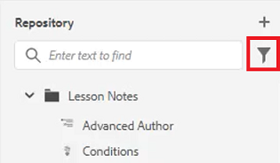

1. 選択したパスにテキストを入力するか、必要に応じて新しいパスを選択します。

   フィルタにテキストを入力すると、ファイルのリストが更新されます。

1. 必要に応じて、検索カテゴリの横にある矢印アイコンをクリックして、検索をさらに絞り込みます。

   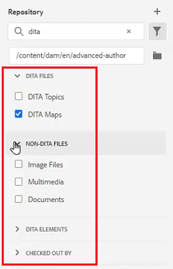

検索は、DITA トピックまたは DITA マップに絞り込むことができます。 選択したパス内で、DITA 以外の画像ファイル、マルチメディア、または他のドキュメントを検索できます。 検索を DITA 要素に制限したり、ファイルのチェックアウトでフィルターしたりすることもできます。

## マップビューを参照する

マップビューでは、ファイルのチェックアウトとロック、マップファイルのプレビュー、Map Dashboard の開く、Assets UI でのマップの表示など、便利な機能がいくつか利用できます。

「 」というタイトルのレッスンを参照してください。 [マップとブックマップ](./maps-and-bookmaps.md) このコースでは、マップビューとその機能の詳細について説明します。

## アウトライン・ビューの参照

アウトライン・ビューは、アウトライン内の現在のドキュメントの階層ビューを提供します。 アウトライン・ビューを展開して、複数の要素と割り当てられた ID を表示できます。

「 」というタイトルのレッスンを参照してください。 [アウトライン表示](./outline-view.md) このコースでは、アウトライン・ビューとその機能の詳細を説明します。

## 再利用可能なコンテンツの使用

DITA のコア機能は、小さなフレーズからトピックやマップ全体にコンテンツを再利用する機能です。 エディターには、コンテンツを再利用するためのドラッグ&amp;ドロップインターフェイスが用意されています。

「 」というタイトルのレッスンを参照してください。 [コンテンツの再利用](./content-reuse.md) このコースでは、再利用可能なコンテンツの詳細と効果的な管理方法を説明します。

## 用語集の操作

用語集を使用すると、情報を一貫して表現しやすくなり、読者にわかりやすくなります。 エディターには、用語集の用語をトピックに挿入するためのドラッグ&amp;ドロップインターフェイスが用意されています。

「 」というタイトルのレッスンを参照してください。 [用語集](./glossary.md) このコースでは、用語集の設定と使用の詳細について説明します。

## 条件の操作

DITA では、多くの場合、製品、プラットフォーム、オーディエンスなどの属性を使用して条件が駆動されます。製品、プラットフォーム、オーディエンスは、それぞれに特定の値を割り当てることができます。 条件は、フォルダープロファイルで管理されます。

「 」というタイトルのレッスンを参照してください。 [条件](./conditions.md) このコースでは、条件付き属性の設定と使用の詳細について説明します。

## スニペットの作成

スニペットは、コンテンツや構造の出発点として再利用できる小さなコンテンツフラグメントです。 スニペットを使用すると、コンテンツの作成に要する時間が短縮され、マテリアルの構造品質と一貫性が向上します。

1. エディターでトピックを開きます。

1. トピック内の要素を選択します。

1. 要素内の 2 番目のマウスボタンをクリックします。

1. 表示されたメニューで、「作成」を選択します。 [!UICONTROL **スニペット**].

   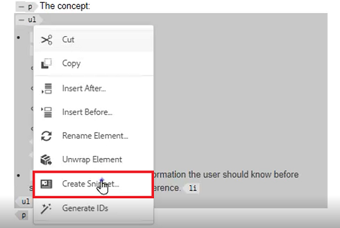

1. 新しいスニペットダイアログで、 **タイトル** および **説明**.

1. 必要に応じてスニペットを編集します。

   コンテキストチェックでは、コンテンツにエラーが発生した場合に視覚的に通知されます。

1. 「[!UICONTROL **作成**]」をクリックします。

スニペットが使用可能なスニペットのリストに追加されます。 トピック内の有効な場所にドラッグ&amp;ドロップする準備が整いました。

## テンプレートの操作

管理者は、テンプレートパネルを使用して、作成者が使用するテンプレートを簡単に作成および管理できます。 デフォルトでは、テンプレートはマップおよびトピックタイプに分類されます。

「 」というタイトルのレッスンを参照してください。 [フォルダープロファイル](./folder-profiles.md) および [シンプルなコンテンツ作成ワークフロー](simple-content-creation-workflows.md) このコースでは、テンプレートの設定と適用の詳細について説明します。

## 検索と置換でファイルを検索

エディターには、「検索」と「置換」の 2 つのオプションがあります。 1 つ目は、従来のワードプロセッサと同様に、特定の開いたトピック内で検索と置換の機能を許可します。 2 つ目は、リポジトリ内の複数のファイル内のテキストを検索する「検索と置換」パネルです。

「 」というタイトルのレッスンを参照してください。 [スペルチェックと検索と置換](./spell-check.md)  このコースでは、検索と置換機能の詳細について説明します。

## コンテンツプロパティを更新

右側のパネルのコンテンツプロパティには、現在選択されている要素に関する特定の情報が含まれています（属性 ID や値など）。

1. でトピックを開く **XML Editor**.

1. を選択します。 **要素**.

   コンテンツのプロパティに、要素の現在の Type と Attributes が表示されます。

1. 新しい **値** 要素の

   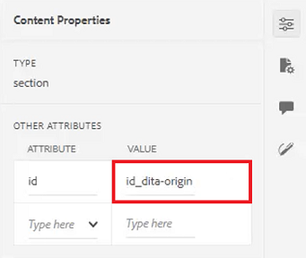

コンテンツプロパティは、要素を変更すると動的に更新されます。

## [ ファイルのプロパティ ] を使用してトピックをマップに追加する

「ファイルのプロパティ」には、開いているトピック全体に関する追加情報が表示されます。 この情報の一部は、トピックのプロパティで制御されます。 ドキュメントの状態など、他のマテリアルに対する変更は、権限に応じて異なる場合があります。

1. エディターでトピックを開きます。

1. 次をクリック： [!UICONTROL  **ファイルのプロパティ**] アイコンをクリックします。

   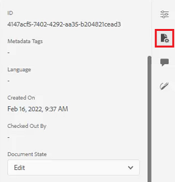

1. を **ドキュメントの状態** から **編集**. 現在、「参照」リストは空白です。

   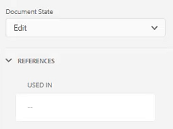

1. トピックを閉じます。

1. 選択 [!UICONTROL **リポジトリ表示**] をクリックします。

1. マップを開きます。

   ビューが [ マップビュー ] に変わります。

1. [!UICONTROL **編集**]&#x200B;アイコンをクリックします。

   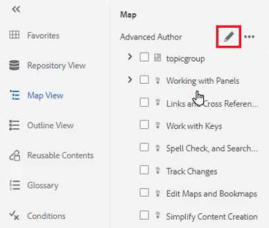

1. マップを開いて編集したら、次に切り替えます。 **リポジトリ表示**.

1. 使用するトピックをマップにドラッグ&amp;ドロップします。

1. 次をクリック： [!UICONTROL **保存**] アイコンをクリックします。

トピックがマップに追加されます。 トピックを開き、ファイルのプロパティを確認すると、指定したマップでトピックが使用されていることを反映するように参照が更新されているのが確認できます。

## レビュータスクの作成

右側のパネルには、レビューワークフローを開始するためのショートカットが含まれています。

1. 次をクリック： [!UICONTROL **レビュー**] アイコンをクリックします。

   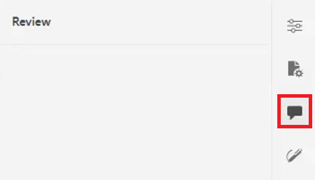

1. クリック [!UICONTROL **レビューを作成**].

   

1. レビュータスクを作成ダイアログで、必要に応じてフィールドに値を入力します。

1. 「[!UICONTROL **次へ**]」をクリックします。

レビュータスクが作成されます。

## 変更の追跡

変更を追跡する機能により、あるバージョンのトピックから次のバージョンまで、どの変更が保持されるかを大幅に制御できます。 右側のパネルを使用して、追跡される変更を管理できます。

「 」というタイトルのレッスンを参照してください。 [変更の追跡](./track-changes.md) このコースでは、変更トラッキング機能の詳細を説明します。
