# シンプルなコンテンツ作成ワークフロー

AEM Guides Editor には、コンテンツ作成ワークフローを簡略化する複数のショートカットが用意されています。 これらのショートカットを使用すると、画像の追加と変更、複数のトピックの同時操作、エラーの修正、トピックPDFのダウンロード、バージョンとラベルの操作を迅速におこなうことができます。

>[!VIDEO](https://video.tv.adobe.com/v/342770)

## 画像を追加

画像は、ローカルドライブから直接追加できます。

1. 画像を直接トピックにドラッグ&amp;ドロップします。 この **アセットをアップロード** ダイアログが表示されます。

   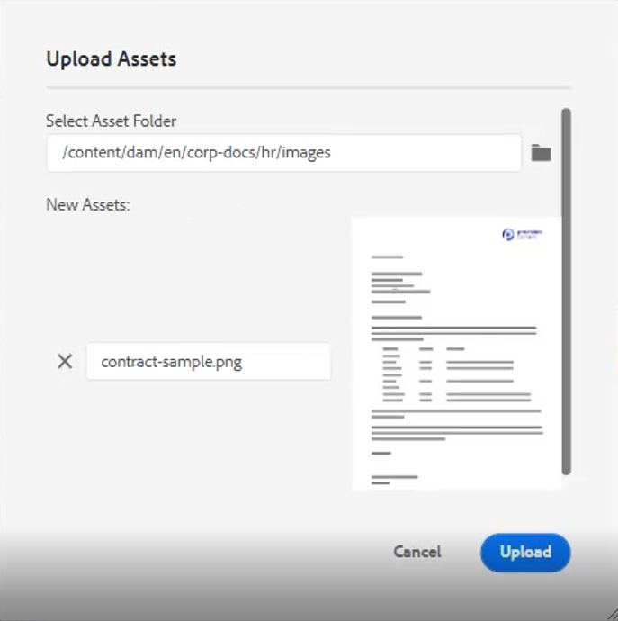

2. 目的の画像の場所に対するフォルダーパスを変更します。

3. 画像名を目的を表す名前に変更します。

4. 「[!UICONTROL **アップロード**]」をクリックします。

## 画像の変更

1. 隅をドラッグ&amp;ドロップして画像のサイズを変更する。

2. 画像をドラッグ&amp;ドロップして、トピック内の別の場所に移動します。

3. 用途 **コンテンツプロパティ** 画像を変更するための右側のパネル

   - スケール

   - position

   - 整列、または

   - その他の属性。

   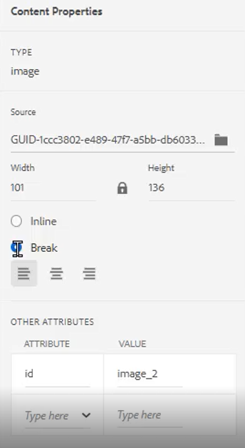

## 複数のトピックの操作

分割ビューは、トピックの比較、トピック間でのコピー&amp;ペースト、またはトピック間でのコンテンツのドラッグ&amp;ドロップを行う場合に便利です。

1. 2 つ以上の関連トピックを開きます。

2. 1 つのファイルの「タイトル」タブをクリックして、コンテキストメニューを開きます。

3. 選択 [!UICONTROL **分割**].

4. 選択 **右**.

   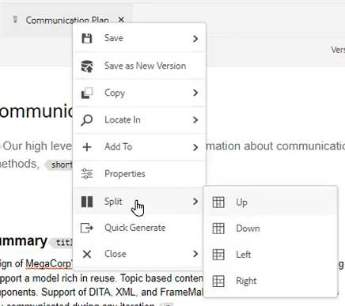

## タイポロジエラーの修正

1. エラーを含む単語または語句を見つけます。

2. 長押し [!UICONTROL **Ctrl**].

3. エラーの 2 番目のマウスボタンをクリックします。

4. 正しいスペルを選択します。

トピックテキストでエラーが修正されました。

## トピックのダウンロードPDF

マークアップまたは他のPDFとの共有を行うために、現在のトピックのトピックをダウンロードしたい場合があります。

1. クリック [!UICONTROL **プレビュー**] をクリックします。

2. 次をクリック： [!UICONTROL **PDFアイコン**] を参照してください。 ダイアログが表示されます。

   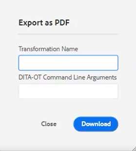

3. 次のいずれかの情報を入力します。 **変換名** または **DITA-OT コマンドライン引数** （必要に応じて） すべてのフィールドが空白の場合、PDFは生成されます。

4. 「[!UICONTROL **ダウンロード**]」をクリックします。PDFが生成します。

5. 使用可能なアイコンを使用して、PDFトピックを設定、ダウンロードまたは共有します。

## リポジトリまたはマップ内でトピックを探します。

1. トピックを開きます。

2. [ タイトル ] タブでマウスのセカンダリボタンをクリックします。

3. 選択 **場所**.

4. 次のいずれかを選択 **リポジトリ** または **マップ** をクリックして、目的のトピックの場所に移動します。

## トピックのバージョン化

1. トピックに変更を加えます。

2. トピックを保存します。

3. 次をクリック： **リポジトリ** アイコンをクリックします。

   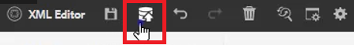

4. ダイアログで、 **新しいバージョンに関するコメント**.

   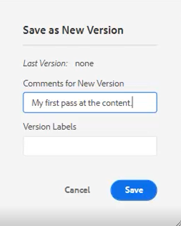

5. 「[!UICONTROL **保存**]」をクリックします。

バージョン番号が更新されます。

## バージョンラベルを読み込み

バージョン番号のみに基づいてトピックの状態を追跡するのは困難な場合があります。 ラベルを使用すると、複数のリビジョンを適用したトピックの正確な状態を識別しやすくなります。

1. を選択します。 **フォルダープロファイル**.

2. フォルダープロファイル内で、XML エディターを設定します。

   a.画面の左上にある「編集」を選択します。

   b.「 XML コンテンツバージョンラベル」で、新しいトピックを追加するか、既存のトピックを使用します。

   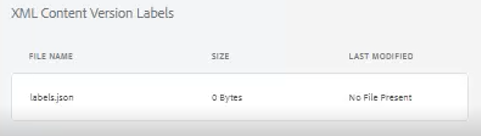

3. 選択 [!UICONTROL **アップロード**].

4. ReviewLabels.json などのファイルを選択します。 このようなファイルの作成方法に関する詳細については、別のビデオで説明します。

5. クリック [!UICONTROL **開く**].

6. クリック [!UICONTROL **保存**] をクリックします。

7. クリック [!UICONTROL **閉じる**] 右上

バージョンラベルが読み込まれるようになりました。

## バージョンラベルの割り当て

1. バージョンラベルを読み込みます。

2. 次をクリック： [!UICONTROL **ユーザーの環境設定**] 現在のトピックの左上にあるアイコン。

   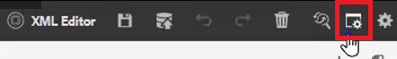

3. バージョンラベルが以前に読み込まれたのと同じフォルダープロファイルを選択します。

4. [ ユーザ環境設定 ] ダイアログで、[ 基本パス ] が、フォルダプロファイルが適用されたのと同じ情報を参照していることを確認します。

   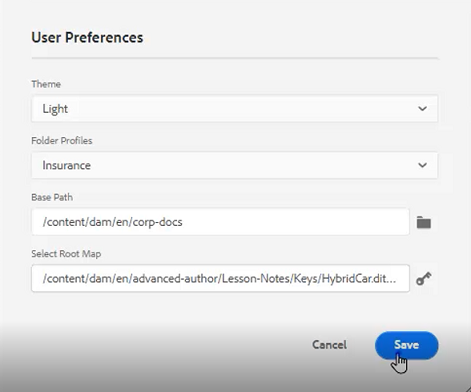

5. 「[!UICONTROL **保存**]」をクリックします。

6. トピックのバージョンを設定します。

7. コメントを追加し、ドロップダウンからバージョンラベルを選択します。

   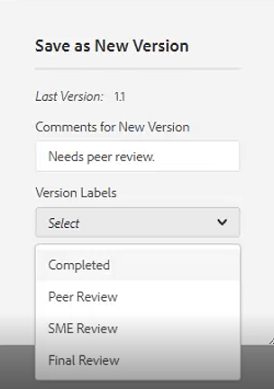

8. 「[!UICONTROL **保存**]」をクリックします。

バージョン番号が更新されます。

## バージョン履歴とラベルを表示

1. 左側のパネルから、現在のトピックのタイトルを探します。

2. タイトルをクリックして、コンテキストメニューを開きます。

3. 選択 [!UICONTROL **Assets UI で表示**].

   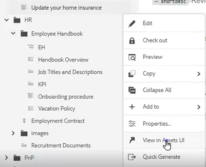

   - ラベル付きのバージョン履歴が左側に表示されます。

   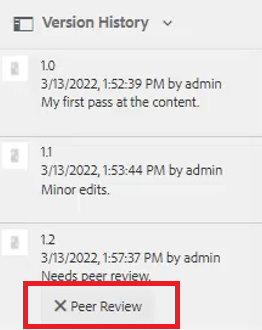

4. バージョンをクリックして、次のようなオプションにアクセスします。 **このバージョンに戻る** および **バージョンをプレビュー**.

## 新しいテンプレートを作成

トピックとマップの両方にテンプレートが存在します。 管理者は、左のパネルでテンプレートにアクセスできます。

1. クリック [!UICONTROL **テンプレート**] をクリックします。

2. 「マップ」または「トピック」を選択して、関連するコンテキストメニューを開きます。

3. 「 」をクリックして、新しいテンプレートを追加します。

   

4. 表示されたダイアログでフィールドに値を入力します。

サンプルコンテンツとサンプル構造を含むシェルテンプレートが表示されます。
