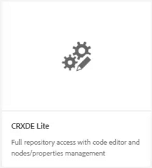
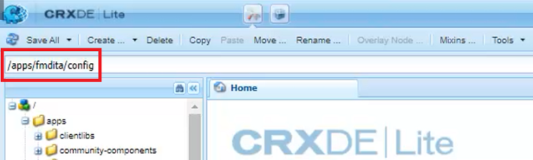
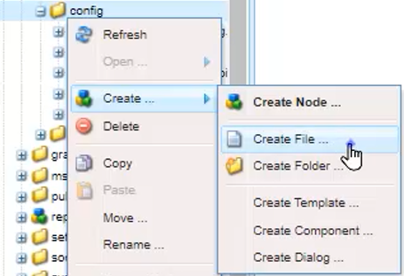
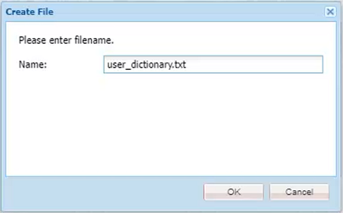
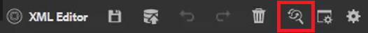
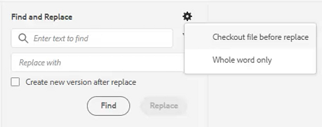
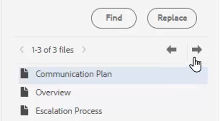

# スペルチェックと検索/置換

AEM Guides Editor には、強力なスペルチェック機能と検索および置換機能が備わっています。

>[!VIDEO](https://video.tv.adobe.com/v/342768?quality=12&learn=on)

スペルミスを修正する

1. 開いているトピックで、赤い下線付きのエラーを見つけます。

2. Ctrl キーを押しながら、その単語内の 2 番目のマウスボタンをクリックします。

3. 修正候補の中から正しいスペルを選択します。

正しいスペルが提示されない場合は、いつでも手動で単語を編集できます。

## AEM Spell Check に切り替え

ブラウザーのデフォルトの辞書以外のスペルチェックツールを使用することもできます。

1. に移動します。 **エディター設定**.

2. を選択します。 **一般** 「設定」タブ

   

3. 選択できるスクリプト言語は次の 2 つです。

   - **ブラウザースペルチェック**  — スペルチェックでブラウザの組み込み辞書を使用するデフォルト設定です。

   - **AEM Spell Check** - AEMカスタム辞書を使用してカスタム単語リストを作成します。

4. 選択 **AEM Spell Check**.

5. 「[!UICONTROL **保存**]」をクリックします。

カスタム辞書の設定

管理者は、会社名などのカスタム単語がAEM辞書で認識されるように設定を変更できます。

1. 次に移動： **ツール** ウィンドウ

2. にログインします。 **CRXDE Lite**.

   

3. 次に移動： **_/apps/fmdita/config ノード_**.

   

4. 新しいファイルを作成します。

   a.config フォルダーを右クリックします。

   b.選択 **作成/ファイルを作成**.

   

   c.ファイルに名前を付ける _**user_dictionary.txt**_.

   

   d.クリック [!UICONTROL **OK**].

5.  ファイルを開きます。

6. カスタム辞書に含める単語のリストを追加します。

7. 「[!UICONTROL **すべて保存**]」をクリックします。

8. ファイルを閉じます。

作成者は、AEM Dictionary で更新されたカスタム単語リストを取得するために、Web エディターセッションを再起動する必要が生じる場合があります。

## 単一ファイル内の検索と置換

1. 上部のツールバーの「検索と置換」アイコンをクリックします。

   

2. 下部のツールバーに、単語または語句を入力します。

3. 「[!UICONTROL **検索**]」をクリックします。

4. 必要に応じて、検索した単語を置き換える単語を入力します。

5. クリック [!UICONTROL **置換**].

## リポジトリ全体での検索と置換

1. 次に移動： **リポジトリ**.

2. 次をクリック： [!UICONTROL **検索と置換**] アイコンをクリックします。

3. 次をクリック： [!UICONTROL **設定を表示**] アイコン

4. 次のいずれかを選択

   - **置換前のチェックアウトファイル**  — 管理者が有効にした場合、検索語句を置き換える前にファイルが自動的にチェックアウトされます。

   - **単語全体のみ**  — 入力した単語または語句のみを返すように検索を制限します。

   

5. 次をクリック： [!UICONTROL **フィルターを適用**] アイコンをクリックして、検索を実行するリポジトリ内のパスを選択します。

6. 検索および置換する用語を入力します。

7. 必要に応じて、「 」を選択します。 **置換後に新しいバージョンを作成**.

8. 「[!UICONTROL **検索**]」をクリックします。

9. 目的のファイルを開き、矢印を使用して、見つかった結果から次の結果に移動します。

   
