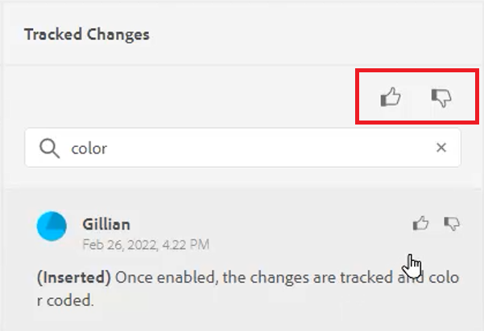
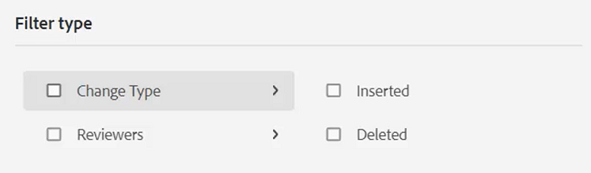
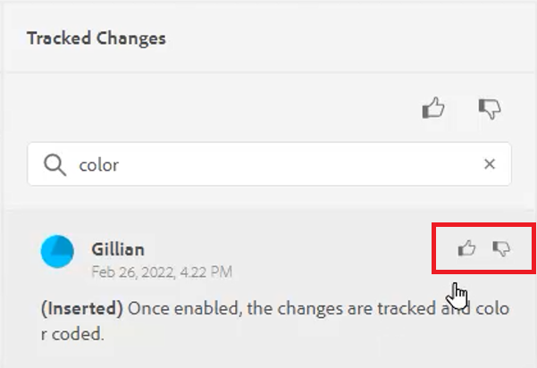

# 変更の追跡

変更を追跡モードを有効にすると、ドキュメントに対して行われたすべての更新を追跡できます。 このモードを使用すると、ドキュメントのレビュープロセス中に、すべての挿入と削除をキャプチャできます。

>[!VIDEO](https://video.tv.adobe.com/v/342763?quality=12&learn=on)

## 変更追跡機能の使用

1. 切り替え **変更の追跡** ツールバーアイコンを使用して、機能を有効（または無効）にします。

   

2. トピックを変更します。

   追加されたコンテンツが、変更バー付きで緑色で表示されるようになりました。 削除したコンテンツは、赤い取り消し線付きで表示されます。

3. を選択します。 **追跡された変更** アイコンをクリックして、変更履歴パネルにアクセスします。

   

4. 「[!UICONTROL **保存**]」をクリックします。

   

5. トピックを閉じます。

これで、他のユーザーがトピックを開いて、既存の追跡された変更を表示できるようになりました。 変更を許可または却下し、独自の変更を追加できます。

## 追跡された変更を検索

スクロールに時間がかかる場合があるので、検索機能は、追跡された変更が多数ある場合に役立ちます。

1. を選択します。 **追跡された変更** アイコンをクリックして、変更履歴パネルにアクセスします。

2. 「検索」フィールドに単語または語句を入力します。
検索を実行すると、検索語に一致する変更が返されます。

## 追跡された変更のフィルター

複数の追跡対象の変更を、挿入、削除またはレビュー担当者でフィルターすることもできます。

1. 次をクリック： [!UICONTROL **フィルター**] アイコンをクリックします。

2. 目的のフィルターのチェックボックスをオンにします。

   

3. 「[!UICONTROL **適用**]」をクリックします。

## 追跡された変更を許可または却下

レビュー担当者と件名のエキスパートは、他のユーザーの変更を、個別またはすべて一度に受け入れるか拒否することができます。

1. 次をクリック： [!UICONTROL **追跡された変更**] アイコンをクリックして、変更履歴パネルにアクセスします。

2. 特定の変更を選択します。

3. 次をクリック： [!UICONTROL **親指を上に**] または [!UICONTROL **下親指**] 変更を許可または却下するアイコン

   

   または

   次をクリック： [!UICONTROL **親指を上に**] または [!UICONTROL **下親指**] すべての変更を許可または却下するための検索バー上のアイコン。

   

4. [!UICONTROL **保存**] トピック。

## 結合機能の使用

複数作成者の環境で作業する場合、トピックまたはマップ内で他の作成者がおこなった変更を追跡するのが困難な場合があります。 結合機能を使用すると、変更の表示だけでなく、ドキュメントの最新バージョンで保持される変更の詳細を制御できます。

1. Web エディターでトピックを開きます。

2. 次をクリック： [!UICONTROL **結合**] アイコンをクリックします。

   

3. [ 結合 ] ダイアログで、現在のバージョンと比較するファイルのバージョンを選択します。

4. 「オプション」から次を選択します。

   - **選択したバージョンからの変更の追跡**:このオプションを選択すると、すべてのコンテンツの更新が、変更を追跡する形式で表示されます。 その後、ドキュメント内の変更を 1 度に 1 つずつ承認または拒否するか、またはすべて一度に拒否するかを選択できます。

   - **選択したバージョンに戻す**:このオプションを選択すると、ドキュメントの現在のバージョンが選択したバージョンに戻されます。 許可または却下されるコンテンツを制御することはできません。

5. 「[!UICONTROL **完了**]」をクリックします。

選択した **「選択したバージョンからの変更の追跡」オプション**&#x200B;をクリックすると、選択したバージョンからのすべての変更が右側のパネルの「変更」タブに表示されます。
