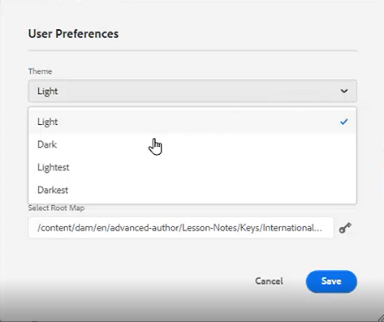

# [ ユーザの環境設定 ]、[ エディタの設定 ]、[ エディタのツールバー ]

エディターには、高度に設定可能なインターフェイスが用意されています。 ユーザーの環境設定、エディターの設定、フォルダーのプロファイルが混在しているので、特定の作業環境に合わせてほぼすべての側面をカスタマイズできます。

>[!VIDEO](https://video.tv.adobe.com/v/342769)

## 要素タグの表示/非表示を切り替える

タグは、要素の境界を示す視覚的なキューです。 要素の境界は、要素の始まりと終わりを示します。 これらの境界を視覚的なキューとして使用して、挿入ポイントを配置したり、境界内のテキストを選択したりできます。

1. 次をクリック： [!UICONTROL **タグ表示を切り替え**] アイコンをクリックします。

   

   トピック内にタグが表示されます。 タグ表示を使用すると、次のことができます。

   - 開始タグまたは終了タグをクリックして、要素のコンテンツを選択します。

   - タグの+記号または — 記号をクリックして、タグを展開または折りたたむ。

   - 選択した要素を切り取る、コピーする、または貼り付けるには、コンテキストメニューを使用します。

   - タグを選択し、要素を有効な場所にドロップして、要素をドラッグ&amp;ドロップします。

2. 次をクリック： [!UICONTROL **タグ表示を切り替え**] アイコンを再度クリックすると、タグが非表示になります。

タグが消え、テキストに焦点を合わせることができます。

## 使用中にアセットをロックする

ファイルをロック（またはチェックアウト）すると、ユーザーはファイルに対する排他的な書き込みアクセス権を付与されます。 ファイルのロックが解除（またはチェックイン）されると、変更はファイルの現在のバージョンに保存されます。

1. 次をクリック： [!UICONTROL **ロック**] アイコンをクリックします。

   

   ファイルがチェックアウトされ、リポジトリ内のファイル名の横にロックアイコンが表示されます。

2. 次をクリック： [!UICONTROL **ロック解除**] アイコン

   

リポジトリが更新され、ファイルがチェックインされたことが示されます。

## 特殊文字を挿入します

1. 次をクリック： [!UICONTROL **特殊文字を挿入**] アイコンをクリックします。

   

2. [ 特殊文字を挿入 ] ダイアログボックスで、検索バーに文字の名前を入力します。

   または、カテゴリの選択ドロップダウンを使用して、特定のカテゴリ内のすべての文字を表示します。

3. 目的の文字を選択します。

4. クリック [!UICONTROL **挿入**].

特殊文字がテキストに挿入されます。

## 作成者モード、ソースモード、プレビューモードを切り替える

画面の右上にあるツールバーを使用して、ビューを切り替えることができます。

- 選択 **作成者** をクリックして、トピックの操作中に構造とコンテンツを表示します。

- 選択 **ソース** をクリックして、トピックを構成する基になる XML を表示します。

- 選択 **プレビュー** を使用して、ユーザーがブラウザーでトピックを表示したときの表示方法を示します。

## ユーザーの環境設定でテーマを変更する

エディターには、「明」または「暗」のテーマを選択できます。 ライトテーマを使用すると、ツールバーとパネルの背景はライトグレーになります。 ダークテーマを使用すると、ツールバーとパネルは黒い背景になります。 どちらのテーマでも、コンテンツ編集領域は白い背景で表示されます。

1. 次をクリック： [!UICONTROL **ユーザーの環境設定**] アイコンをクリックします。

   

2. ユーザーの環境設定ダイアログで、 [!UICONTROL **テーマ**] ドロップダウン。

3. 使用可能なオプションから選択します。

   

4. 「[!UICONTROL **保存**]」をクリックします。

エディターが更新され、目的のテーマが表示されます。

## ユーザーの環境設定でのベースパスの更新

ベースパスを更新して、エディターを起動するとすぐに、リポジトリビューに特定の場所のコンテンツが表示されるようにすることができます。 これにより、作業ファイルにアクセスする時間が短縮されます。

1. 次をクリック： [!UICONTROL **ユーザーの環境設定**] アイコンをクリックします。

   

2. ユーザーの環境設定ダイアログで、 [!UICONTROL **フォルダー**] アイコンをクリックします。

   

3. パスを選択ダイアログで、特定のフォルダーの横にあるチェックボックスをクリックします。

4. 「[!UICONTROL **選択**]」をクリックします。

次にエディタを起動すると、リポジトリには、ベースパスで指定されたファイルが表示されます。

## 新しいフォルダープロファイルを割り当て

「グローバルプロファイル」はシステムのデフォルト設定です。 管理者は、追加のフォルダープロファイルを作成して、そこから選択できます。

1. 次をクリック： [!UICONTROL **ユーザーの環境設定**] アイコンをクリックします。

   

2. ユーザーの環境設定ダイアログで、 [!UICONTROL **フォルダープロファイル**] ドロップダウン。

   

3. 使用可能なオプションからプロファイルを選択します。

4. 「[!UICONTROL **保存**]」をクリックします。

これで、新しいフォルダープロファイルが割り当てられます。 左側のパネルのツールバーオプション、表示モード、条件およびスニペットが変更されました。 また、エディターでのコンテンツの外観を変更する場合もあります。

## エディター設定で辞書を変更

管理者ユーザーは、エディター設定を使用できます。 これらの環境設定では、様々な設定を行うことができます。その設定の 1 つは、エディターがスペルチェックに使用する辞書です。

1. 次をクリック： [!UICONTROL **エディター設定**] アイコンをクリックします。

   

2. [ エディタ設定 ] ダイアログで、 [!UICONTROL **一般**] タブをクリックします。

3. 使用する辞書を選択します。

4. 「[!UICONTROL **保存**]」をクリックします。

辞書が更新されます。 AEM Spell Check に切り替えると、カスタムの単語リストを使用できることに注意してください。

## エディター設定でパネルを表示/非表示

エディタ設定でカスタマイズできる機能の 1 つはパネルです。 具体的には、エディターで表示または非表示にするパネルを選択できます。

1. 次をクリック： [!UICONTROL **エディター設定**] アイコンをクリックします。

   

2. [ エディタ設定 ] ダイアログで、 [!UICONTROL **パネル**] タブをクリックします。

3. 必要に応じて、使用可能なパネルを表示/非表示に切り替えます。

   

4. 「[!UICONTROL **保存**]」をクリックします。

これで、左側のパネルは、表示に切り替えられたパネルのみを表示するように設定されました。

## エディタ設定の名前とラベルの要素

「要素リスト」を使用すると、特定の要素に名前を付け、よりわかりやすいラベルを割り当てることができます。 要素名は、DITA 要素の 1 つである必要があります。 ラベルには任意の文字列を指定できます。

1. 次をクリック： [!UICONTROL **エディター設定**] アイコンをクリックします。

   

2. [ エディタ設定 ] ダイアログで、 [!UICONTROL **要素リスト**] タブをクリックします。

3. を入力します。 **要素名** および **ラベル** 各フィールド内の

4. 次をクリック： [!UICONTROL **プラス**] アイコンをクリックして、リストに要素を追加します。

   

5. 「[!UICONTROL **保存**]」をクリックします。

要素リストへの変更は、エディターの既存のタグで直ちに確認できます。 また、新しい要素を追加する際に表示されるオプションにも表示されます。

## エディタ設定の名前とラベル属性

属性リストは、要素リストと同様に機能します。 エディタ設定から、属性のリストとその表示名を制御できます。

1. 次をクリック： [!UICONTROL **エディター設定**] アイコンをクリックします。

   

2. [ エディタ設定 ] ダイアログで、 [!UICONTROL **属性リスト**] タブをクリックします。

3. を入力します。 **属性名** および **ラベル** 各フィールド内の

4. 次をクリック： [!UICONTROL **プラス**] アイコンをクリックして、リストに属性を追加します。

## エディター設定での条件の設定

「条件」タブでは、複数のプロパティを設定できます。

1. 次をクリック： [!UICONTROL **エディター設定**] アイコンをクリックします。

   

2. [ エディタ設定 ] ダイアログで、 [!UICONTROL **条件**] タブをクリックします。

3. 適用する条件のチェックボックスをオンにします。

   

4. 「[!UICONTROL **保存**]」をクリックします。

## エディター設定での公開プロファイルの作成

公開プロファイルは、ナレッジベースの公開に使用できます。 例えば、Salesforce は、消費者キーと消費者秘密鍵を持つ設定済みのアプリを使用します。 この情報は、Salesforce 公開プロファイルの作成に使用できます。

1. 次をクリック： [!UICONTROL **エディター設定**] アイコンをクリックします。

   

2. [ エディタ設定 ] ダイアログで、 [!UICONTROL **プロファイル**] タブをクリックします。

3. 次をクリック： [!UICONTROL **プラス**] プロファイルの横のアイコン

4. 必要に応じてフィールドに値を入力します。

5. 「[!UICONTROL **保存**]」をクリックします。

公開プロファイルが作成されました。
